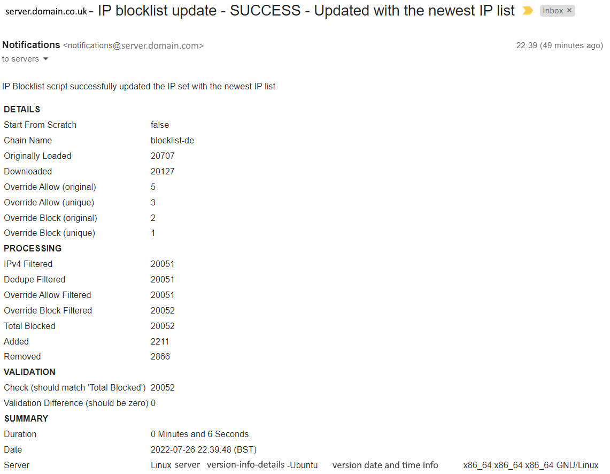
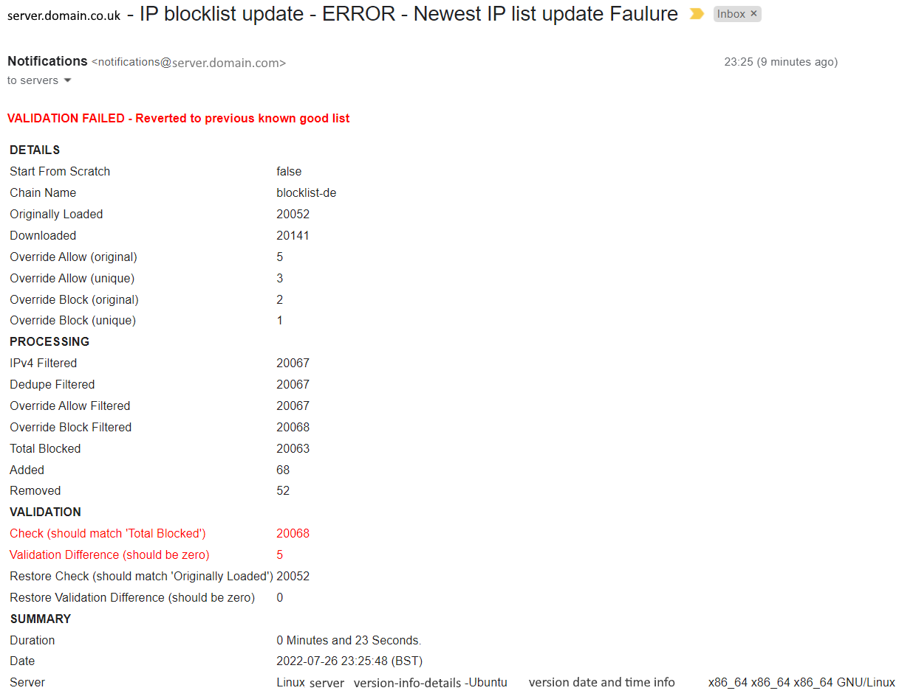
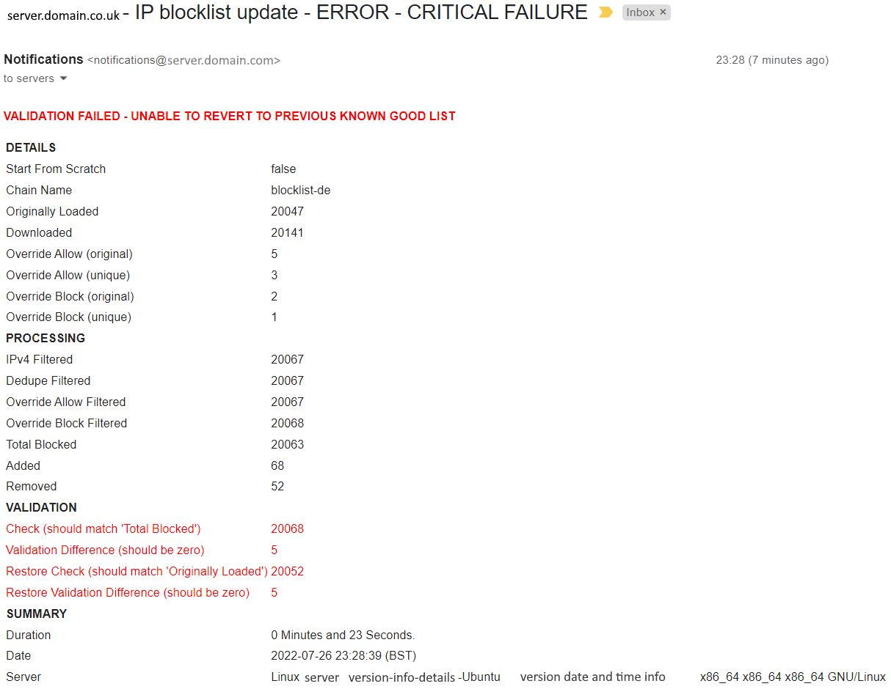

# aubs-blocklist-importer
  Blocklist import script for IPTools/IPSet<br/>
  https://github.com/AubsUK/aubs-blocklist-importer


# Contents
[Top of Page](#aubs-blocklist-importer)<br/>
[Information](#information)<br/>
[Quick Start](#quick-start)<br/>
[Configurable Options](#configurable-options)<br/>
[Files Used and Created](#files-used-and-created)<br/>
[Planned changes](#planned-changes-in-no-particular-order)<br/>
[Example outputs](#example-outputs)<br/>
[Removal](#removal)<br/>
[Notes](#notes)<br/>

<br/><br/>


# Information
|[Back to top](#aubs-blocklist-importer)|<br/><br/>
This is a simple blocklist import script that works with single IPv4 addresses (no ranges or IPv6 support yet).
- Runs automatically (via Cron)
- Imports a list of IPs to block from a URL text file
- Strips out anything non-IPv4 related
- Removes duplicates
- Custom lists to override the importing blocklist
  - Allow list - Never block anything on this list even if it *is* in the download (e.g. your own or customer IPs)
  - Block list - Always block anything on this list even if it *isn't* in the download (e.g. IPs of frequent attackers or spammers)
- Checks for an existing chain and that everything is already set up, or creates them
- Compares the new import blocklist against the existing blocked list
  - only import new IPs
  - remove old IPs not on the new list
- Checks the new live list matches the filtered import list
  - If it doesn't, it clears the configuration and tries to re-import the previous (known-good) list
  - It then checks if the re-import of the known-good list is successful
- Full logging
- Email notifications
  - Email Success/Failure switches, these allow set days when 'success' and 'failure' emails are sent.
  - Notifications can also be set so if a 'failure' occurs, a the next 'success' is also alerted, even if it's not a 'success' alert day.


<br/><br/>


# Quick Start
|[Back to top](#aubs-blocklist-importer)|<br/><br/>
Switch to a secure location to hold the script
```
cd /usr/local/sbin/
```
Clone the repository as root so permissions are set appropriately
```
sudo git clone https://github.com/AubsUK/aubs-blocklist-importer
```
or just create the three files manually, and copy their contents

Make the script executable
```
cd aubs-blocklist-importer
sudo chmod 700 aubs-blocklist-importer.sh
```
Edit ```override-allowlist.txt``` and ```override-blocklist.txt``` to include IPs to never block (e.g. your own servers) and always block (servers that frequently attack you)<br/>
```
sudo nano override-allowlist.txt
```
```
sudo nano override-blocklist.txt
```

Add an entry into Cron
```
sudo nano /etc/crontab
```
Add in:
```
# Blocklist Importer
0 * * * * root /usr/local/sbin/aubs-blocklist-importer/aubs-blocklist-importer.sh # Run on the hour, every hour
```
**Note:** Make it as frequent as required (within reason, check the blocklist's website to confirm the maximum);

<br/><br/>

# Files Used and Created

|[Back to top](#aubs-blocklist-importer)|<br/><br/>

Following the Quick Start instructions and not modifying any variables, the following files are used:

### /usr/local/sbin/aubs-blocklist-importer/

<table>
<tr><th>File Name</th><th>Purpose</th></tr>
<tr>
<td>aubs-blocklist-importer.sh</td>
<td>The script file</td>
</tr>
<tr>
<td>override-allowlist.txt</td>
<td>Override allow-list containing IPs one on each line to always allow even if they *are* in the blocklist</td>
</tr>
<tr>
<td>override-blocklist.txt</td>
<td>Override block-list containing IPs one on each line to always block even if they *are not* in the blocklist</td>
</tr>
<tr>
<td>Last_Run_Status.txt</td>
<td>Stores the status of the last run and the day</td>
</tr>
</table>


### /var/log/
<table>
<tr><th>File Name</th><th>Purpose</th></tr>
<td>aubs-blocklist-importer.log</td>
<td>Stores the logs from each run</td>
</tr>
<tr>
<td>
.git/ (folder and all sub files)
<br>
images/ (folder and all sub files)
<br>
LICENSE<br>README.md<br>
</td>
<td>Git files, not used by the script</td>
</tr>
</table>

### /usr/local/sbin/aubs-blocklist-importer/
If `DELETE_ALL_FILES_ON_COMPLETION` is set to `false` the following files will remain in the main folder, otherwise they will be deleted after each run
<table>
<tr><th>File Name</th><th>Purpose</th></tr>
<tr>
<td>ip-blocklist.download</td>
<td>Main file that the download list is imported into and processed</td>
</tr>
<tr>
<td>ip-blocklist.download.compare.add</td>
<td>Items processed that aren't in the existing (to be added)</td>
</tr>
<tr>
<td>ip-blocklist.download.compare.rem</td>
<td>Existing items that aren't in the processed (to be removed)</td>
</tr>
<tr>
<td>ip-blocklist.download.Dedupe</td>
<td>Downloaded file processed with duplicates removed</td>
</tr>
<tr>
<td>ip-blocklist.download.IPv4</td>
<td>Downloaded file processed with only IPv4 addresses</td>
</tr>
<tr>
<td>ip-blocklist.download.Original</td>
<td>Copy of the original download file</td>
</tr>
<tr>
<td>ip-blocklist.download.OverrideAllow</td>
<td>Downloaded file processed with override allow-list addresses removed</td>
</tr>
<tr>
<td>ip-blocklist.download.OverrideAllowTEMP</td>
<td>Temporary override allow-list files sorted and deduped</td>
</tr>
<tr>
<td>ip-blocklist.download.OverrideBlock</td>
<td>Downloaded file processed with override block-list addresses added</td>
</tr>
<tr>
<td>ip-blocklist.download.OverrideBlockTEMP</td>
<td>Temporary override block-list files sorted and deduped</td>
</tr>
<tr>
<td>ip-blocklist.existing</td>
<td>List of existing IPs from the current IP chain</td>
</tr>
<tr>
<td>ip-blocklist.existing.check1</td>
<td>List of IPs to confirm successful import</td>
</tr>
<tr>
<td>ip-blocklist.existing.check2</td>
<td>List of IPs to confirm successful import></td>
</tr>
<tr>
<td>ip-blocklist.existing.validate1</td>
<td>List of IPs remaining after checking</td>
</tr>
<tr>
<td>ip-blocklist.existing.validate2</td>
<td>List of IPs remaining after checking</td>
</tr>
</table>

<br/><br/>

# Configurable Options

|[Back to top](#aubs-blocklist-importer)|<br/><br/>
<table>
<tr><th>Variable</th><th>Description</th><th>Default</th></tr>
<tr>
<td colspan=3>

### General

</td>
</tr>
<tr>
<td>

`START_FROM_SCRATCH`

</td>
<td>
Clear out the IPTable and IPSet for the $CHAINNAME on each run
</td>
<td>
false
</td>
</tr>
<tr>
<td>

`DELETE_ALL_FILES_ON_COMPLETION`

</td>
<td>
Delete the temporary files on completion, useful for debugging if something is wrong with the block lists
</td>
<td>
true
</td>
</tr>
<tr>
<td colspan=3>

### Basic settings

</td>
</tr>
<tr>
<td>

`DOWNLOAD_FILE`

</td>
<td>
URL of the text file which contains all the IPs to use
</td>
<td>
http://lists.blocklist.de/lists/all.txt
</td>
</tr>
<tr>
<td>

`CHAINNAME`

</td>
<td>
Name of the chain to import the IPs in to
</td>
<td>
blocklist-de
</td>
</tr>
<tr>
<td>

`ACTION`

</td>
<td>
The action script should apply to the firewall rule<br>Either ALLOW (for known IPs), BLOCK, or REJECT for this Chain
</td>
<td>
REJECT
</td>
</tr>
<tr>
<td>

`MIN_COUNT`

</td>
<td>
Minimum IPs in the download file to consider it a legitimate download
</td>
<td>
100
</td>
</tr>
<tr>
<td colspan=3>

### Base defaults

</td>
</tr>
<tr>
<td>

`PathOfScript=`

</td>
<td>
Path of the script file
<td>

"$(dirname "$(realpath "$0")")/"

</td>
</tr>
<tr>
<td>

`BASE_PATH`

</td>
<td>
/path/to/ temp files location
<td>

Uses `$PathOfScript` which uses the location of the script file

</td>
</tr>
<tr>
<td>

`BLOCKLIST_BASE_FILE`

</td>
<td>
Base filename for the temporary files created
</td>
<td>
ip-blocklist
</td>
</tr>
<tr>
<td colspan=3>

### E-Mail notification variables

</td>
</tr>
<tr>
<td>

`SENDER_NAME`

</td>
<td>
Display name of the sender
</td>
<td>
Notifications
</td>
</tr>
<tr>
<td>

`SENDER_EMAIL`

</td>
<td>
Senders email address
</td>
<td>

Automatically configured to `notifications@server.domain.co.uk`<br/>(where server.domain.co.uk is provided automatically from `hostname -f`)

</td>
</tr>
<tr>
<td>

`RECIPIENT_EMAIL`

</td>
<td>
Recipient email address<br/>(multuple recipients separated by commas)
</td>
<td>

Automatically configured to `servers@domain.co.uk`<br/>(where domain.co.uk is provided automatically from `hostname -d`)

</td>
</tr>
<tr>
<td>

`SUBJECT`

</td>
<td>
Start of the subject for success and failure emails
</td>
<td>

`server.domain.co.uk - IP blocklist update - `<br/>(where server.domain.co.uk is provided from `hostname -f`)

</td>
</tr>
<tr>
<td>

`EMAIL_SUCCESS_DAYS`

</td>
<td>
Days SUCCESS emails should be sent - Leave blank to disable [1=Monday, 7=Sunday] (1,4=Mon,Thu)
</td>
<td>

1,4

</td>
</tr>
<tr>
<td>

`EMAIL_SUCCESS_TYPE`

</td>
<td>
When to send success emails (if run multiple times a day) [NONE, FIRST, ALL] (only on the days in SUCCESS_DAYS)
</td>
<td>

FIRST

</td>
</tr>
<tr>
<td>

`EMAIL_FAILURE_DAYS=`

</td>
<td>
Days FAILURE emails should be sent - Leave blank to disable [1=Monday, 7=Sunday] (1,2,3,4,5,6,7=Mon,Tue,Wed,Thu,Fri,Sat,Sun)
</td>
<td>

1,2,3,4,5,6,7

</td>
</tr>
<tr>
<td>

`EMAIL_FAILURE_TYPE`

</td>
<td>
When to send failure emails (if run multiple times a day) [NONE, FIRST, ALL]
</td>
<td>

FIRST

</td>
</tr>
<tr>
<td>

`EMAIL_FAILURE_SUCCESS_OVERRIDE`

</td>
<td>
For multi-day runs, as long as the FAILURE_DAYS is 1-7 and FAILURE_TYPE isn't NONE, when a FAILURE is received after a SUCCESS, an email will be sent (last run=success, this run=failure).
<br>
The same will happen for SUCCESS if SUCCESS_DAYS is 1-7 and SUCCESS_TYPE isn't NONE, that after a FAILURE, a SUCCESS email will be received.
<br>
On the other hand, as FAILUREs will be sent, a SUCCESS might not to confirm it has been restored until the next SUCCESS_DAY when a SUCCESS can be received.  Set this to true and a FAILURE/SUCCESS email will be sent the first time the new status changes, but no other times unless scheduled.
</td>
<td>

true

</td>
</tr>
<tr>
<td colspan=3>

### Permanent files

</td>
</tr>
<tr>
<td>

`OVERRIDE_ALLOWLIST_PATH`

</td>
<td>
Location of the override allow-list
</td>
<td>

The same as `$BASE_PATH`

</td>
</tr>
<tr>
<td>

`OVERRIDE_ALLOWLIST_FILE`

</td>
<td>
Filename of the override allow-list
</td>
<td>
override-allowlist.txt
</td>
</tr>
<tr>
<td>

`OVERRIDE_BLOCKLIST_PATH`

</td>
<td>
Location of the override block-list
</td>
<td>

The same as `$BASE_PATH`

</td>
</tr>
<tr>
<td>

`OVERRIDE_BLOCKLIST_FILE`

</td>
<td>
Filename of the override allow-list
</td>
<td>
override-blocklist.txt
</td>
</tr>
<tr>
<td>

`LOGFILE_PATH`

</td>
<td>
Location of the log file
</td>
<td>

A new directory in the /var/log/ path called `/var/log/aubs-blocklist-import/`

</td>
</tr>
<tr>
<td>

`LOGFILE_FILE`

</td>
<td>
Filename of the log file
</td>
<td>
aubs-blocklist.log
</td>
</tr>

<tr>
<td>

`LAST_RUN_PATH`

</td>
<td>
Location of the last run file
</td>
<td>
$BASE_PATH
</td>
</tr>
<tr>
<td>

`LAST_RUN_FILE`

</td>
<td>
Filename of the last run information (this includes the day number for use in email allowed days)
</td>
<td>
Last_Run_Status.txt
</td>
</tr>
<tr>
<td colspan=3>

### Packages used

</td>
</tr>
<tr>
<td>

`IPTABLES_PATH`
<br>
`IPSET_PATH`
<br>
`SORT_PATH`
<br>
`SENDMAIL_PATH`
<br>
`GREP_PATH`
<br>
`WGET_PATH`
<br>
`PERL_PATH`


</td>
<td>
Location of the main packages used.  These should normally be installed, but if not, it'll report in the log and stop running
</td>
<td>

$(which iptables)
<br>
$(which ipset)
<br>
$(which sort)
<br>
$(which sendmail)
<br>
$(which grep)
<br>
$(which wget)
<br>
$(which perl)

</td>
</tr>
<tr>

</table>

<br/><br/>


# Testing
|[Back to top](#aubs-blocklist-importer)|<br/><br/>
The script contains two useful test lines when the script goes through the validation checks.
<br><br>
The first pretends the filtered download list `$Blocklist_File` has 5 lines less than it should, so when the imported list doesn't match the filtered download list, it'll try and restore the last known good list (line 449):
```
#sed -i '1,5d' $BLOCKLIST_FILE #TESTING1 == REMOVE THE FIRST FIVE LINES FROM THE FILTERED ORIGINAL FILE
```
And the second is used after the first validation check fails, which then pretends the second validation check of the last known good list `$BLOCKLIST_EXISTING` has 5 lines less than it should, so when the last known good list doesn't match the last known good import validation, it'll output that it's all failed (line 495):
```
#	sed -i '1,5d' $BLOCKLIST_EXISTING #TESTING2 == REMOVE THE FIRST FIVE LINES FROM THE ORIGINAL EXISTING FILE
```

<br/><br/>


# Planned changes (in no particular order)
|[Back to top](#aubs-blocklist-importer)|<br/><br/>
1. Allow cron to take the download file URL and chain name as variables, so multiple can be run from one script
2. Using the same chain with multiple blocklists (perhaps download all at once, then filter through before adding - Size limitations?).
3. Incorporate IPv6 IP addresses
4. If a firewall rule exists in the chain, check if the ACTION is the same each time and change if it's different e.g. DROP to REJECT
5. Check if the path is a path or a file/path for all variables
```
  BASE_PATH_CheckPath=${BASE_PATH%/*}
  BASE_PATH_CheckFile=${BASE_PATH##*/}
  echo "PATH [ $BASE_PATH_CheckPath ]"
  echo "FILE [ $BASE_PATH_CheckFile ]"
```
6. Check if BASE_PATH is a valid and/or a 'bad' path like in /proc/ or something
7. --DONE-- ~~Change logging to give the option to enter additional test (e.g. 'done' at the end of the previous logged line)~~
8. Consider removing the variables for the programs being used, I don't really think these are necessary because the ones being used are mostly 'standard' - Check if they are POSIX, or alternatives.  Most others being used are: date, touch, echo, if, exit, rm, mv, cp, wc, sed, comm, cat. [ipset was not on some of my servers]
9. Work with subnets, expand them to individual IPs or if IPSet allows them.
10. --DONE-- ~~Enable/Disable email notifications, or set them to only send every X days (and list the days in email).~~
11. --DONE-- ~~Check import was successful~~
12. Warn if any 'override allow' exist in the blocklist
13. Allow use of list from a local file (e.g. manual syncing)
14. --DONE-- ~~Don't import if downloaded file contains less than a defined number of rows~~
15. If a run results in a 'success' but errors or critical, it should send a FAILURE email.
16. Correct spelling mistake on [L638](https://github.com/AubsUK/aubs-blocklist-importer/blob/main/aubs-blocklist-importer.sh#L638)
17. Remove debugging messages from [L201 to L217](https://github.com/AubsUK/aubs-blocklist-importer/blob/main/aubs-blocklist-importer.sh#L201) and [L222](https://github.com/AubsUK/aubs-blocklist-importer/blob/main/aubs-blocklist-importer.sh#L222) and [L233](https://github.com/AubsUK/aubs-blocklist-importer/blob/main/aubs-blocklist-importer.sh#L233) and [L248](https://github.com/AubsUK/aubs-blocklist-importer/blob/main/aubs-blocklist-importer.sh#L248)
18. Add automatic retry count/delay to reduce the number of failure emails.


<br/><br/>


# Example outputs
|[Back to top](#aubs-blocklist-importer)|<br/><br/>
<br/>
## Successful manual run
- The original download contained [20127] rows; filtering out 76 rows not IPv4 [20051]; no duplicate IPs found (still [20051]).
- 3 unique Override Allow IPs weren't in the list, so none to remove (still [20051]); 1 unique Override Block IP present to add (took it up to [20052]).
- All the IPtables / IPsets configs exist, nothing new to do.
- Exported the existing list and compared it; only added [2211] IPs and rmeoved [2866].
- Exported the new existing list [20052]; compared it to the expected filtered download list [20052]; confirmed both match
- Finished in 6 seconds.
```
me@server:/usr/local/sbin/aubs-blocklist-importer$ sudo ./aubs-blocklist-importer.sh
Tue 26 Jul 22:39:42 BST 2022:  ================================================================================
Tue 26 Jul 22:39:42 BST 2022:
Tue 26 Jul 22:39:42 BST 2022:  Using Base Path [ /usr/local/sbin/aubs-blocklist-importer/ ]
Tue 26 Jul 22:39:42 BST 2022:  Deleting any existing blocklist files. (/usr/local/sbin/aubs-blocklist-importer/ip-blocklist.*)
Tue 26 Jul 22:39:42 BST 2022:  Downloading the most recent IP list from http://lists.blocklist.de/lists/all.txt... Successful [20127]
Tue 26 Jul 22:39:43 BST 2022:
Tue 26 Jul 22:39:43 BST 2022:  Filter out anything not an IPv4 address [20051]
Tue 26 Jul 22:39:43 BST 2022:  Removing duplicate IPs. [20051]
Tue 26 Jul 22:39:43 BST 2022:  Removing Override allow-list IPs (3 unique) [20051]
Tue 26 Jul 22:39:43 BST 2022:  Adding Override block-list IPs...  (1 unique) [20052]
Tue 26 Jul 22:39:43 BST 2022:
Tue 26 Jul 22:39:43 BST 2022:  Checking the configuration for 'blocklist-de'...
Tue 26 Jul 22:39:43 BST 2022:      IP set already exists
Tue 26 Jul 22:39:43 BST 2022:      Chain already exists
Tue 26 Jul 22:39:43 BST 2022:      Chain already in INPUT
Tue 26 Jul 22:39:43 BST 2022:      Firewall rule already exists in the chain
Tue 26 Jul 22:39:43 BST 2022:
Tue 26 Jul 22:39:43 BST 2022:  Getting the existing list for the 'blocklist-de' IP set
Tue 26 Jul 22:39:43 BST 2022:
Tue 26 Jul 22:39:43 BST 2022:  Comparing the New and Existing lists...
Tue 26 Jul 22:39:43 BST 2022:  Adding [2211] new IPs into the IP set... Done
Tue 26 Jul 22:39:45 BST 2022:  Removing [2866] old IPs from the IP set... Done
Tue 26 Jul 22:39:48 BST 2022:
Tue 26 Jul 22:39:48 BST 2022:  Checking imported 'blocklist-de' matches downloaded list... Filtered Download [20052] - Filtered Existing [20052]... Validated
Tue 26 Jul 22:39:48 BST 2022:
Tue 26 Jul 22:39:48 BST 2022:  Process finished in 0 Minutes and 6 Seconds.
Tue 26 Jul 22:39:48 BST 2022:  Writing last status of [SUCCESS6] to /usr/local/sbin/aubs-blocklist-importer/Last_Run_Status.txt
Tue 26 Jul 22:39:48 BST 2022:  NOT sending SUCCESS email
Tue 26 Jul 22:39:48 BST 2022:  Deleting any existing blocklist files. (/usr/local/sbin/aubs-blocklist-importer/ip-blocklist.*)
Tue 26 Jul 22:39:48 BST 2022:
Tue 26 Jul 22:39:48 BST 2022:  ================================================================================
```


<br/><br/>

## Unsuccessful manual run (with successful restore)
- Pretty similar to the successful run.
- Testing removed 5 IPs from the filtered download [20068] --> [20063]; doesn't match the live list [20063].
- Rebuilds IPtable and IPset config for the chain.
- Imports the list and confirms it matches the last known good.
```
me@server:/usr/local/sbin/aubs-blocklist-importer$ sudo ./aubs-blocklist-importer.sh
Tue 26 Jul 23:25:25 BST 2022:  ================================================================================
Tue 26 Jul 23:25:25 BST 2022:
Tue 26 Jul 23:25:25 BST 2022:  Using Base Path [ /usr/local/sbin/aubs-blocklist-importer/ ]
Tue 26 Jul 23:25:25 BST 2022:  Deleting any existing blocklist files. (/usr/local/sbin/aubs-blocklist-importer/ip-blocklist.*)
Tue 26 Jul 23:25:25 BST 2022:  Downloading the most recent IP list from http://lists.blocklist.de/lists/all.txt... Successful [20141]
Tue 26 Jul 23:25:26 BST 2022:
Tue 26 Jul 23:25:26 BST 2022:  Filter out anything not an IPv4 address [20067]
Tue 26 Jul 23:25:26 BST 2022:  Removing duplicate IPs. [20067]
Tue 26 Jul 23:25:26 BST 2022:  Removing Override allow-list IPs (3 unique) [20067]
Tue 26 Jul 23:25:26 BST 2022:  Adding Override block-list IPs...  (1 unique) [20068]
Tue 26 Jul 23:25:26 BST 2022:
Tue 26 Jul 23:25:26 BST 2022:  Checking the configuration for 'blocklist-de'...
Tue 26 Jul 23:25:26 BST 2022:      IP set already exists
Tue 26 Jul 23:25:26 BST 2022:      Chain already exists
Tue 26 Jul 23:25:26 BST 2022:      Chain already in INPUT
Tue 26 Jul 23:25:26 BST 2022:      Firewall rule already exists in the chain
Tue 26 Jul 23:25:26 BST 2022:
Tue 26 Jul 23:25:26 BST 2022:  Getting the existing list for the 'blocklist-de' IP set
Tue 26 Jul 23:25:26 BST 2022:
Tue 26 Jul 23:25:26 BST 2022:  Comparing the New and Existing lists...
Tue 26 Jul 23:25:26 BST 2022:  Adding [68] new IPs into the IP set... Done
Tue 26 Jul 23:25:26 BST 2022:  Removing [52] old IPs from the IP set... Done
Tue 26 Jul 23:25:26 BST 2022:
Tue 26 Jul 23:25:26 BST 2022:  Checking imported 'blocklist-de' matches downloaded list... Filtered Download [20063] - Filtered Existing [20068]... ERROR !!! - They don't match
Tue 26 Jul 23:25:26 BST 2022:  An error occurred with importing the download
Tue 26 Jul 23:25:26 BST 2022:
Tue 26 Jul 23:25:26 BST 2022:  Resetting the chain
Tue 26 Jul 23:25:26 BST 2022:      Flushed IPTable Chain
Tue 26 Jul 23:25:26 BST 2022:      Flushed IPSet Chain
Tue 26 Jul 23:25:26 BST 2022:      Destroyed IPSet Chain
Tue 26 Jul 23:25:26 BST 2022:      Deleted IPTable INPUT Join
Tue 26 Jul 23:25:26 BST 2022:      Deleted IPTable Chain
Tue 26 Jul 23:25:26 BST 2022:  Creating a new chain
Tue 26 Jul 23:25:26 BST 2022:      New IP set created
Tue 26 Jul 23:25:26 BST 2022:      New chain created
Tue 26 Jul 23:25:26 BST 2022:      Chain added to INPUT
Tue 26 Jul 23:25:26 BST 2022:      Firewall rule created
Tue 26 Jul 23:25:26 BST 2022:
Tue 26 Jul 23:25:26 BST 2022:  Importing the previous existing list... Done
Tue 26 Jul 23:25:48 BST 2022:  Re-checking restored 'blocklist-de' version matches original existing... Original [20052] - Current [20052]... Validated
Tue 26 Jul 23:25:48 BST 2022:
Tue 26 Jul 23:25:48 BST 2022:  Process finished in 0 Minutes and 23 Seconds.
Tue 26 Jul 23:25:48 BST 2022:
Tue 26 Jul 23:25:48 BST 2022:  ================================================================================
```


<br/><br/>

## Unsuccessful manual run (with unssuccessful restore - Complete Failure)
- As with the unsuccessful run, the download import failed.  This time, the restore also fails.
- Testing removed 5 IPs from the filtered download [20068] --> [20063]; doesn't match the live list [20063].
- Rebuilds IPtable and IPset config for the chain.
- Imports the last known good list
- Testing removes 5 IPs from the last known good after importing [20052] --> [20047]; fails to match the live list [20052].
- Not much can be done now, the IPset will contain what it has, but may need manual intervention.
- The next automatic run may correct this.
```
me@server:/usr/local/sbin/aubs-blocklist-importer$ sudo ./aubs-blocklist-importer.sh
Tue 26 Jul 23:28:16 BST 2022:  ================================================================================
Tue 26 Jul 23:28:16 BST 2022:
Tue 26 Jul 23:28:16 BST 2022:  Using Base Path [ /usr/local/sbin/aubs-blocklist-importer/ ]
Tue 26 Jul 23:28:16 BST 2022:  Deleting any existing blocklist files. (/usr/local/sbin/aubs-blocklist-importer/ip-blocklist.*)
Tue 26 Jul 23:28:16 BST 2022:  Downloading the most recent IP list from http://lists.blocklist.de/lists/all.txt... Successful [20141]
Tue 26 Jul 23:28:16 BST 2022:
Tue 26 Jul 23:28:16 BST 2022:  Filter out anything not an IPv4 address [20067]
Tue 26 Jul 23:28:16 BST 2022:  Removing duplicate IPs. [20067]
Tue 26 Jul 23:28:16 BST 2022:  Removing Override allow-list IPs (3 unique) [20067]
Tue 26 Jul 23:28:16 BST 2022:  Adding Override block-list IPs...  (1 unique) [20068]
Tue 26 Jul 23:28:17 BST 2022:
Tue 26 Jul 23:28:17 BST 2022:  Checking the configuration for 'blocklist-de'...
Tue 26 Jul 23:28:17 BST 2022:      IP set already exists
Tue 26 Jul 23:28:17 BST 2022:      Chain already exists
Tue 26 Jul 23:28:17 BST 2022:      Chain already in INPUT
Tue 26 Jul 23:28:17 BST 2022:      Firewall rule already exists in the chain
Tue 26 Jul 23:28:17 BST 2022:
Tue 26 Jul 23:28:17 BST 2022:  Getting the existing list for the 'blocklist-de' IP set
Tue 26 Jul 23:28:17 BST 2022:
Tue 26 Jul 23:28:17 BST 2022:  Comparing the New and Existing lists...
Tue 26 Jul 23:28:17 BST 2022:  Adding [68] new IPs into the IP set... Done
Tue 26 Jul 23:28:17 BST 2022:  Removing [52] old IPs from the IP set... Done
Tue 26 Jul 23:28:17 BST 2022:
Tue 26 Jul 23:28:17 BST 2022:  Checking imported 'blocklist-de' matches downloaded list... Filtered Download [20063] - Filtered Existing [20068]... ERROR !!! - They don't match
Tue 26 Jul 23:28:17 BST 2022:  An error occurred with importing the download
Tue 26 Jul 23:28:17 BST 2022:
Tue 26 Jul 23:28:17 BST 2022:  Resetting the chain
Tue 26 Jul 23:28:17 BST 2022:      Flushed IPTable Chain
Tue 26 Jul 23:28:17 BST 2022:      Flushed IPSet Chain
Tue 26 Jul 23:28:17 BST 2022:      Destroyed IPSet Chain
Tue 26 Jul 23:28:17 BST 2022:      Deleted IPTable INPUT Join
Tue 26 Jul 23:28:17 BST 2022:      Deleted IPTable Chain
Tue 26 Jul 23:28:17 BST 2022:  Creating a new chain
Tue 26 Jul 23:28:17 BST 2022:      New IP set created
Tue 26 Jul 23:28:17 BST 2022:      New chain created
Tue 26 Jul 23:28:17 BST 2022:      Chain added to INPUT
Tue 26 Jul 23:28:17 BST 2022:      Firewall rule created
Tue 26 Jul 23:28:17 BST 2022:
Tue 26 Jul 23:28:17 BST 2022:  Importing the previous existing list... Done
Tue 26 Jul 23:28:39 BST 2022:  Re-checking restored 'blocklist-de' version matches original existing... Original [20047] - Current [20052]... ERROR !!! - Still an issue
Tue 26 Jul 23:28:39 BST 2022:
Tue 26 Jul 23:28:39 BST 2022:  Process finished in 0 Minutes and 23 Seconds.
Tue 26 Jul 23:28:39 BST 2022:
Tue 26 Jul 23:28:39 BST 2022:  ================================================================================

```


<br/><br/>
## Unsuccessful automatic run (tried to download the list, but it wasn't successful)
- As with the unsuccessful run, the download import failed.  This time, the restore also fails.
- Testing removed 5 IPs from the filtered download [20068] --> [20063]; doesn't match the live list [20063].
- Rebuilds IPtable and IPset config for the chain.
- Imports the last known good list
- Testing removes 5 IPs from the last known good after importing [20052] --> [20047]; fails to match the live list [20052].
- Not much can be done now, the IPset will contain what it has, but may need manual intervention.
- The next automatic run may correct this.
```
me@server:/usr/local/sbin/aubs-blocklist-importer$ sudo ./aubs-blocklist-importer.shSat 10 Dec 22:21:14 GMT 2022:  ================================================================================
Sat 10 Dec 22:21:14 GMT 2022:
Sat 10 Dec 22:21:14 GMT 2022:  Using Base Path [ /usr/local/sbin/aubs-blocklist-importer/ ]
Sat 10 Dec 22:21:14 GMT 2022:  Deleting any existing blocklist files. (/usr/local/sbin/aubs-blocklist-importer/ip-blocklist.*)
Sat 10 Dec 22:21:14 GMT 2022:  Downloading the most recent IP list from http://lists.blocklist.de/lists/all.txt...  IP blocklist could not be downloaded from 'http://lists.blocklist.de/lists/all.txt' [ Downloaded 0, below minimum of 100]
Sat 10 Dec 22:21:14 GMT 2022:  Writing last status of [FAILURE7] to /usr/local/sbin/aubs-blocklist-importer/Last_Run_Status.txt
Sat 10 Dec 22:21:14 GMT 2022:  Sending FAILURE email
Sat 10 Dec 22:21:14 GMT 2022:  ================================================================================
```


<br/><br/>

# Removal
If you installed the script using the quick start guide, it's pretty easy to remove.

Edit crontab and remove the ```# Blocklist Importer``` line and the line below it:
```
sudo nano /etc/crontab
```
Move into the sbin folder and delete the ```aubs-blocklist-importer``` folder:
```
cd /usr/local/sbin/
sudo rm -r aubs-blocklist-importer
```
Move into the logs folder and delete the ```aubs-blocklist-importer``` folder:
```
cd /var/log/
sudo rm -r aubs-blocklist-importer
```
That's it, everything has been removed.

<br/><br/>


# Notes
|[Back to top](#aubs-blocklist-importer)|<br/><br/>
This script was born through the need for a script to do exactly what I wanted.  I took a lot of inspiration from [Lexo.ch](https://www.lexo.ch/blog/2019/09/blocklist-de-iptables-ipset-update-script-how-to-automatically-update-your-firewall-with-the-ip-set-from-blocklist-de/), and lots of support from [Stack Overflow](https://stackoverflow.com/) and related sites, along with may other sites.
