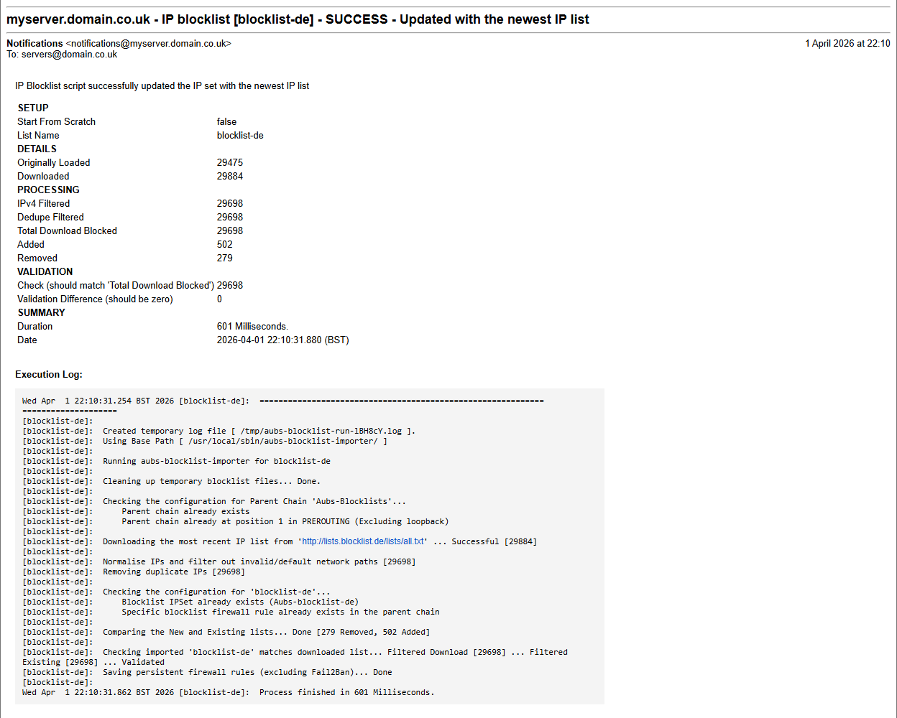
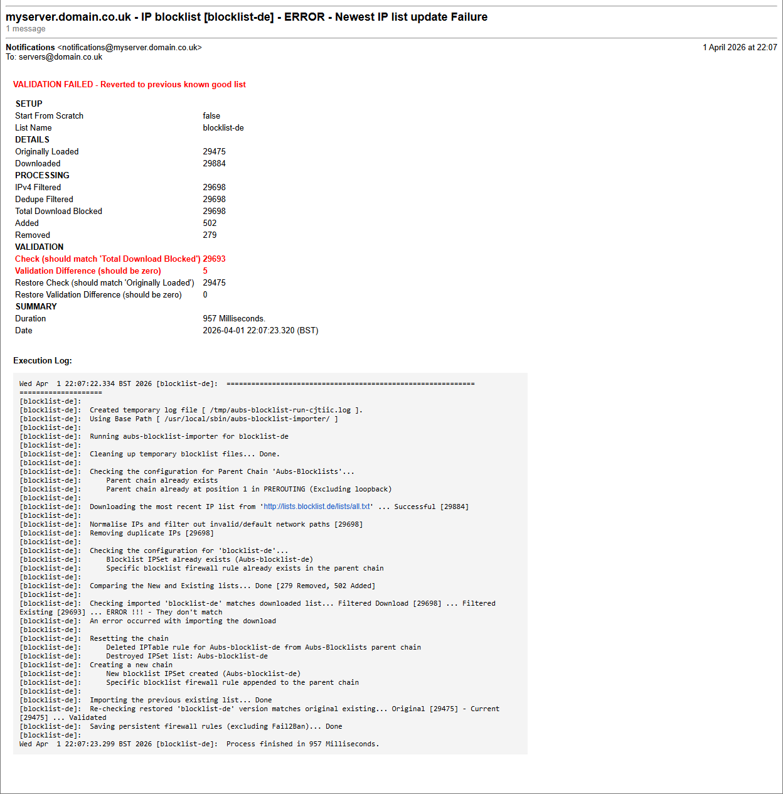
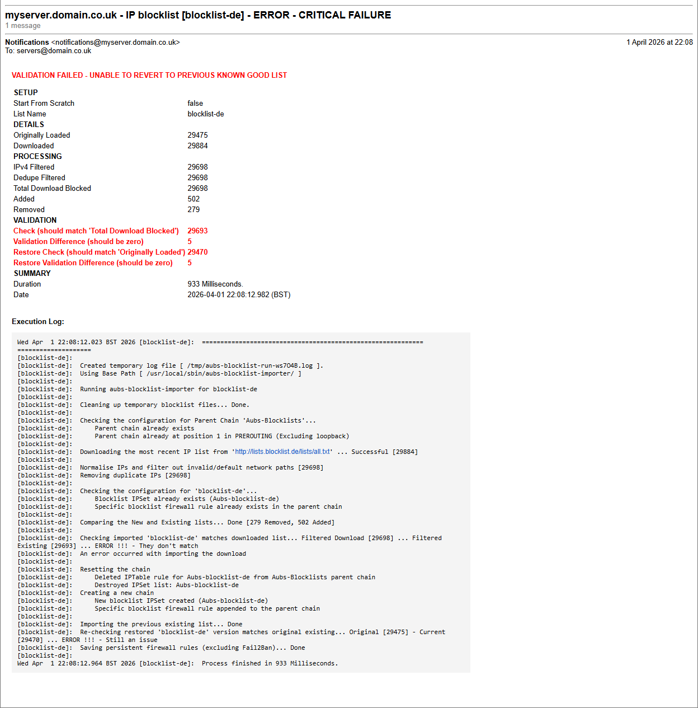
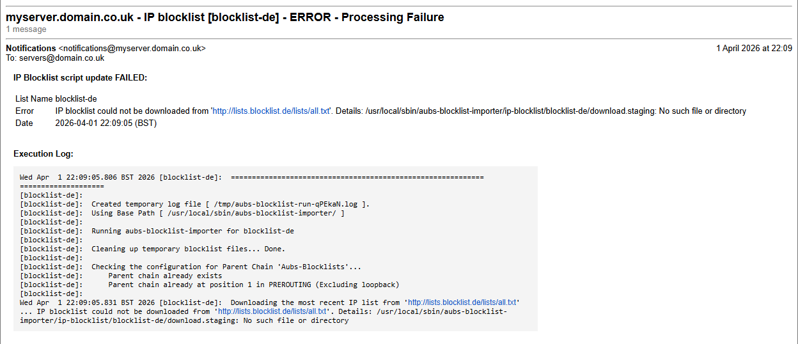
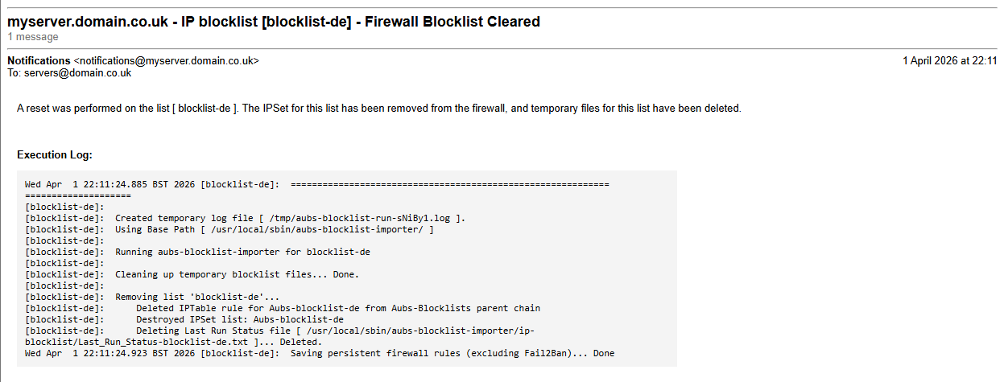
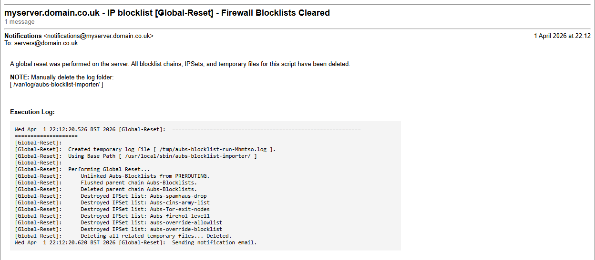

# aubs-blocklist-importer

**Version:** v0.4.0  
Blocklist importer for ipset + iptables (raw PREROUTING)

🔗 https://github.com/AubsUK/aubs-blocklist-importer

Fast, validated IP blocklist ingestion for Linux firewalls using `ipset` and `iptables`.

Designed for:
- High-performance pre-conntrack filtering (raw PREROUTING).
- Incremental updates with full validation and rollback.
- Multi-source blocklist aggregation with override control.

When Not to Use:
- If IPv6 support is required (not yet implemented, but on the cards).
- If per-rule logging is required (the `raw` table bypasses `iptables` logging).
- If the firewall is managed by an external cloud provider.

<br/>


# Contents

- [Information](#information)
- [Quick Start (Simple Setup)](#quick-start-simple-setup)
- [Guided Setup](#guided-setup)
- [Useful Commands](#useful-commands)
- [Fail2Ban Integration](#fail2ban-integration)
- [Configurable Options](#configurable-options)
- [Files Used and Created](#files-used-and-created)
- [Testing](#testing)
- [Planned Changes](#planned-changes-in-no-particular-order)
- [Example Outputs](#example-outputs)
- [Troubleshooting](#troubleshooting)
- [Removal](#removal)
- [Notes](#notes)

<br/>


# Information

|[Back to top](#contents)|

## What it does
This is a fast multi-blocklist import script using `ipset` and the `iptables` `raw` table.  It works with single IPv4 addresses, and fully supports IPv4-CIDR notation in Override Allowlist and Override Blocklist files (no IPv6 support yet).

- Runs automatically (via Cron).
- Imports a list of IPs to block from a URL text file.
- Supports managing multiple different blocklists using command-line arguments.
- Drops traffic at the `PREROUTING` stage (before connection tracking), minimising `conntrack` overhead for maximum efficiency.
- Strips out anything non-IPv4 related and makes sure IP ranges are correctly formatted (e.g. normalises `192.168.1.5/24` to `192.168.1.0/24`) via an inline Python 3 script.
- Removes duplicates.
- Custom lists to override IPs in imported blocklists:
  - Override Allowlist - Never block anything on this list even if it *is* in a downloaded blocklist (e.g. own or trusted IPs).
  - Override Blocklist - Always block anything on this list even if it *isn't* in a downloaded blocklist (e.g. IPs of frequent attackers or spammers).
- Saves the newly updated `ipset` lists to disk, making them persistent across reboots while actively filtering out temporary Fail2Ban rules.
- Full logging.
- Email notifications for Success/Failure, including state-change overrides and critical alerts.

## How it works
1. Uses `flock` to ensure only one instance of the script runs for a specific list at any time.
2. Checks for an existing parent chain and ensures everything is already set up.
3. Downloads the target list and verifies the line count against the `MIN_COUNT` threshold.
4. Processes the list through a Python 3 script to validate IPv4 structures and normalise CIDR boundaries.
5. Compares the new import blocklist against the existing blocked list using `comm`:
   - Only imports new IPs.
   - Removes old IPs not on the new list.
6. Verifies that the applied `ipset` exactly matches the filtered source list.
7. Changes are applied incrementally, then validated against the source.  If validation fails, it clears the configuration and safely restores the previous known-good list.
8. If validation succeeds, it saves the sanitised persistent firewall state via `netfilter-persistent`.

<br/>

---

# Quick Start (Simple Setup)

|[Back to top](#contents)|

> [!WARNING]
> When updating from a previous version, review the '[Upgrading from v0.3.0 or earlier](#upgrading-from-v030-or-earlier)' section within the 'Guided Setup'.

> [!WARNING]
> If a Mail Transfer Agent (MTA) (e.g. Postfix or Sendmail) is already installed, another does not need to be installed.
>
> Review the '[Mail Transfer Agent (MTA)](#mail-transfer-agent-mta)' section within the 'Guided Setup'.

> [!TIP]
> To make sure the blocklists are kept up to date, review the '[Configure Cron](#configure-cron)' section within the 'Guided Setup'.

```bash
# An MTA is required for email notifications (see the warning block above for options).
# sudo apt install postfix
# ...Select "Satellite system"
# ...Provide FQDN of the server
# ...Provide FQDN of the mail server
sudo apt install git iptables ipset coreutils grep wget python3 netfilter-persistent ipset-persistent

cd /usr/local/sbin
sudo git clone https://github.com/AubsUK/aubs-blocklist-importer
cd aubs-blocklist-importer
sudo chmod 700 aubs-blocklist-importer.sh

# Run overrides first
sudo ./aubs-blocklist-importer.sh --overrides

# Run a test list
sudo ./aubs-blocklist-importer.sh --listname blocklist-de --mincount 100 --url "http://lists.blocklist.de/lists/all.txt"
```

<br/>

---

# Guided Setup

|[Back to top](#contents)|

## Prerequisites

### Mail Transfer Agent (MTA)

> [!IMPORTANT]
> A Mail Transfer Agent (MTA) (e.g. Postfix or Sendmail) is needed for this script to send emails.  If one is already installed, another does not need to be installed.  If emails are not required, ignore this step
> Test to see if an MTA is set up by running the following command (replacing the email address with a valid one).  An email should be received:
> ```bash
> echo -e "Subject: Postfix Queue Test\n\nTesting the queuing relay." | /usr/sbin/sendmail -v destination_email@domain.co.uk
> ```

<details>
<summary>More details on setting up postfix as an MTA</summary>

Install Postfix:
```bash
sudo apt install postfix
```
Postfix will offer several prompts:
1. When using a dedicated mail server, choose `Satellite system`.
2. System mail name: Leave as the server's default FQDN (e.g. myserver.domain.co.uk).
3. SMTP Relay Host: Enter the hostname (e.g. mail.domain.co.uk) [If using an IP to avoid any DNS/MX lookups, enter the IP in square brackets].

Make sure the config file is completely locked down so the server is not running an open relay:
```bash
sudo nano /etc/postfix/main.cf
```
Check for these two lines towards the bottom:
```text
relayhost = mail.domain.co.uk OR relayhost = [10.1.2.3]
inet_interfaces = loopback-only
```
Apply the changes:
```bash
sudo systemctl restart postfix
```
Test the configuration:
```bash
echo -e "Subject: Postfix Queue Test\n\nTesting the queuing relay." | /usr/sbin/sendmail -v destination_email@domain.co.uk
```
</details>

<details>
<summary>More details on setting up msmtp as a lightweight MTA</summary>

`msmtp` can be installed with [THIS IS UNTESTED]:
```bash
sudo apt install msmtp msmtp-mta
```
and configured with:
```bash
sudo nano /etc/msmtprc
```
entering:
```text
# System-wide msmtp configuration for relay
defaults
auth           off
tls            off
syslog         on

# The Relay Mail Server
account        user_name # Replace with the user account for the mail server
host           10.x.x.x  # Replace with the mail server's IP/hostname
port           25        # Standard unencrypted SMTP port
from           root@myserver

# Set as default
account default : user_name
```
then securing it with:
```bash
sudo chown root:root /etc/msmtprc
sudo chmod 600 /etc/msmtprc
```
Finally, it can be tested with:
```bash
sudo sh -c 'echo -e "Subject: Email Relay Test\n\nTesting direct delivery." | sendmail -v destination_email@domain.co.uk'
```
</details>


### General packages
> [!TIP]
> The `git` packages aren't required if creating the script manually.
Ensure the following packages are installed:
```bash
sudo apt install git iptables ipset coreutils grep wget python3 netfilter-persistent ipset-persistent
```

## Prepare the Script
Switch to a secure location to hold the script:
```bash
cd /usr/local/sbin/
```

Clone the repository as root so permissions are set appropriately (or just create the script manually, and copy its contents):
```bash
sudo git clone https://github.com/AubsUK/aubs-blocklist-importer
```

Make the script executable:
```bash
cd aubs-blocklist-importer
sudo chmod 700 aubs-blocklist-importer.sh
```

## Upgrading from v0.3.0 or earlier
When upgrading from version 0.3.0 or earlier, the legacy cleanup command should be run once to locate and remove the old firewall rules and `ipset` entries before scheduling the new version (it will prompt for each potential rule it finds):
```bash
sudo /usr/local/sbin/aubs-blocklist-importer/aubs-blocklist-importer.sh --legacy-cleanup
```

## Prepare the Override files
> [!IMPORTANT]
> When using multiple servers that 'talk' to each other, it might be important to add them to the allow-list so that they don't get blocked.  This isn't essential, but if one server ends up on a blocklist, the communication will fail.

Edit `override-allowlist.txt` to include IPs to never block (e.g. known-safe servers or networks) and `override-blocklist.txt` to always block (servers that frequently attack).  CIDR format (e.g. 192.168.1.0/24) is fully supported.  (If either file isn't created or populated now, they'll automatically be created empty in the directory set in `OVERRIDE_PATH` on the first `--overrides` run).
```bash
sudo nano override-allowlist.txt
sudo nano override-blocklist.txt
```

## Configure Cron
Edit Cron to set up automated updating:
```bash
sudo nano /etc/crontab
```
Add in entries like the following.

> [!IMPORTANT]
> Ensure the `--overrides` job is scheduled to run **before** any blocklist jobs.  This guarantees trusted IPs are loaded into the firewall first, preventing legitimate IPs from being accidentally dropped by downstream blocklists!

```bash
# Blocklist Importer
00 8,20 * * * root  /usr/local/sbin/aubs-blocklist-importer/aubs-blocklist-importer.sh --overrides                                                                                                # Run at 08:00 and 20:00
05 8,20 * * * root  /usr/local/sbin/aubs-blocklist-importer/aubs-blocklist-importer.sh --listname blocklist-de --mincount 100 --url "http://lists.blocklist.de/lists/all.txt"                     # Run at 08:05 and 20:05
10 8,20 * * * root  /usr/local/sbin/aubs-blocklist-importer/aubs-blocklist-importer.sh --listname spamhaus-drop --mincount 100 --url "https://www.spamhaus.org/drop/drop.txt"                     # Run at 08:10 and 20:10
15 8,20 * * * root  /usr/local/sbin/aubs-blocklist-importer/aubs-blocklist-importer.sh --listname firehol-level1 --mincount 100 --url "https://iplists.firehol.org/files/firehol_level1.netset"   # Run at 08:15 and 20:15
20 8,20 * * * root  /usr/local/sbin/aubs-blocklist-importer/aubs-blocklist-importer.sh --listname cins-army-list --mincount 100 --url "http://cinsscore.com/list/ci-badguys.txt"                  # Run at 08:20 and 20:20
25 8,20 * * * root  /usr/local/sbin/aubs-blocklist-importer/aubs-blocklist-importer.sh --listname Tor-exit-nodes --mincount 100 --url "https://check.torproject.org/torbulkexitlist"              # Run at 08:25 and 20:25
```

<br/>

---

# Useful Commands
|[Back to top](#contents)|

<details>
<summary>Click to expand the useful commands</summary>

### Script Execution & Overrides

```bash
# Reset all blocklists
sudo /usr/local/sbin/aubs-blocklist-importer/aubs-blocklist-importer.sh --globalreset
```
```bash
# Remove the overrides or a specific blocklist (remember to remove the Cron entry too)
sudo /usr/local/sbin/aubs-blocklist-importer/aubs-blocklist-importer.sh --overrides --remove
sudo /usr/local/sbin/aubs-blocklist-importer/aubs-blocklist-importer.sh --listname blocklist-de --remove
```
```bash
# Reset and re-apply the overrides or a specific blocklist
sudo /usr/local/sbin/aubs-blocklist-importer/aubs-blocklist-importer.sh --overrides --scratch
sudo /usr/local/sbin/aubs-blocklist-importer/aubs-blocklist-importer.sh --listname blocklist-de --scratch
```
```bash
# Manually run the script for specific blocklists
sudo /usr/local/sbin/aubs-blocklist-importer/aubs-blocklist-importer.sh --overrides
sudo /usr/local/sbin/aubs-blocklist-importer/aubs-blocklist-importer.sh --listname blocklist-de --mincount 100 --url "http://lists.blocklist.de/lists/all.txt"
sudo /usr/local/sbin/aubs-blocklist-importer/aubs-blocklist-importer.sh --listname spamhaus-drop --mincount 100 --url "https://www.spamhaus.org/drop/drop.txt"
sudo /usr/local/sbin/aubs-blocklist-importer/aubs-blocklist-importer.sh --listname firehol-level1 --mincount 100 --url "https://iplists.firehol.org/files/firehol_level1.netset"
sudo /usr/local/sbin/aubs-blocklist-importer/aubs-blocklist-importer.sh --listname cins-army-list --mincount 100 --url "http://cinsscore.com/list/ci-badguys.txt"
sudo /usr/local/sbin/aubs-blocklist-importer/aubs-blocklist-importer.sh --listname Tor-exit-nodes --mincount 100 --url "https://check.torproject.org/torbulkexitlist"
```

### `iptables` Management

```bash
# View all the existing FILTER table INPUT rules
sudo iptables -t filter -L INPUT -v -n --line-numbers
```
```bash
# View all the existing RAW table PREROUTING rules
sudo iptables -t raw -L PREROUTING -v -n --line-numbers
```
```bash
# View all the lists in the 'Aubs-Blocklists' chain in the RAW table
sudo iptables -t raw -L Aubs-Blocklists -v -n --line-numbers
```
```bash
# Delete the 'Aubs-Blocklists' chain from the PREROUTING chain in the RAW table (does not delete the ipset lists)
sudo iptables -t raw -D PREROUTING -j Aubs-Blocklists
```
```bash
# Delete the 'aubs-test' rule for RETURN or the 'blocklist-de' rule for DROP from
# the 'Aubs-Blocklists' chain in the RAW table
sudo iptables -t raw -D Aubs-Blocklists -m set --match-set aubs-test src -j RETURN
sudo iptables -t raw -D Aubs-Blocklists -m set --match-set Aubs-blocklist-de src -j DROP
```
```bash
# Delete the 'aubs-test' or 'blocklist-de' rule from the FILTER table INPUT chain (old method cleanup)
sudo iptables -t filter -D INPUT -j aubs-test
sudo iptables -t filter -D INPUT -j blocklist-de
```
```bash
# Flush (empty) or Delete the 'aubs-test' or 'blocklist-de' chains (old method)
sudo iptables -F aubs-test
sudo iptables -X aubs-test
sudo iptables -F blocklist-de
sudo iptables -X blocklist-de
```

### `ipset` Management

```bash
# View the content of the 'aubs-override-blocklist' Override Blocklist
# NOTE: If this is a large list, it could take some time.  Consider using the next two commands instead
sudo ipset list aubs-override-blocklist

# Get the number of IPs (lines) in the 'aubs-override-blocklist' Override Blocklist
sudo ipset list aubs-override-blocklist | wc -l

# Extract all IPs in the 'aubs-override-blocklist' Override Blocklist to the 'aubs-override-blocklist.txt' file
sudo ipset list aubs-override-blocklist >> ~/aubs-override-blocklist.txt
```

```bash
# Flush (empty) the 'Aubs-test' or 'Aubs-blocklist-de' ipset
sudo ipset flush Aubs-test
sudo ipset flush Aubs-blocklist-de
```
```bash
# Destroy (delete) the 'Aubs-test' or 'Aubs-blocklist-de' ipset
sudo ipset destroy Aubs-test
sudo ipset destroy Aubs-blocklist-de
```
```bash
# Completely flush (empty) and Destroy (delete) the entire parent chain
# (WARNING: Detaches ALL blocklists so they are not effective, but does not delete the blocklists)
sudo iptables -t raw -F Aubs-Blocklists
sudo iptables -t raw -X Aubs-Blocklists
```
```bash
# Flush (empty) and Destroy (delete) the iptables chain/list if one exists (old method)
sudo iptables -F blocklist-de
sudo iptables -X blocklist-de
```

### Development / Debugging Only

> [!CAUTION]
> The `truncate` command will erase the script file completely.  Do not run this blindly.

```bash
# Clear the script file, edit the script (to paste in the code) and run it manually with default settings
sudo truncate -s 0 /usr/local/sbin/aubs-blocklist-importer/aubs-blocklist-importer.sh
sudo nano /usr/local/sbin/aubs-blocklist-importer/aubs-blocklist-importer.sh
sudo /usr/local/sbin/aubs-blocklist-importer/aubs-blocklist-importer.sh
```

</details>

<br/>

---

# Fail2Ban Integration
|[Back to top](#contents)|

Fail2Ban can automatically append banned IP addresses to the Override Blocklist, moving temporary bans into permanent blocks and reducing the overhead and database size of Fail2Ban.  This basically bypasses Fail2Ban's expiry process by elevating bans to permanent entries.

> [!WARNING]
> This makes Fail2Ban bans effectively permanent unless manually removed from the `override-blocklist.txt` file!

<details>
<summary>Click to expand the Fail2Ban integration details</summary>

### 1. Create the Custom Action
Create a new action file for Fail2Ban to write to the blocklist:
```bash
sudo nano /etc/fail2ban/action.d/aubs-blocklist-importer-override-blocklist.conf
```
Add in:
```ini
[Definition]
# This action appends the banned IP to the aubs-blocklist-importer override-blocklist
actionban = echo "<ip> # Fail2Ban <name> $(date +%%F)" >> /usr/local/sbin/aubs-blocklist-importer/override-blocklist.txt

# Leave actionunban blank so the IP stays in the text file permanently
actionunban = 

[Init]
name = default
```

### 2. Configure the Jails
Attach the new action to the required jails in `/etc/fail2ban/jail.local`.  (Make sure to `#` comment out any old lines that might conflict).
```bash
sudo nano /etc/fail2ban/jail.local
```
Add in:
```ini
## NOTE: If NOT using Aubs-Blocklist-Importer, switch round the commented out items.
enabled = true
port = all
filter = perm-ban
logpath = /var/log/fail2ban.log
maxretry = 2                ; 2 repeat offender bans
findtime = 365d             ; within  365 days (31536000s)
## With Aubs-Blocklist-Importer
bantime  = 7d               ; banned by Aubs-Blocklist
banaction = iptables-allports
action = %(action_mwl)s
         aubs-blocklist-importer-override-blocklist[name=%(__name__)s]  ; add to override-blocklist.txt
## Without Aubs-Blocklist-Importer
#bantime  = 365d              ; ban for 365 days (31536000s)
#banaction = iptables-allports
#action = %(action_mwl)s
## Aubs-Blocklist-Importer END
```
### 3. Emergency Reset (If Required)
To completely reset Fail2Ban's blocklist memory back to default, use the following commands.  (Note: This does *NOT* remove the blocks added to `aubs-blocklist-importer`.  See [Removal](#removal) and use the `--remove` switch).
```bash
## Reset Fail2Ban blocklist IPs back to default

# 1. Stop the Fail2Ban service
sudo systemctl stop fail2ban

# 2. Clear the Fail2Ban SQLite database  (a new empty database will automatically be created when the service starts)
sudo rm /var/lib/fail2ban/fail2ban.sqlite3

# 3. Force logrotate to immediately archive and clear the relevant application logs (examples below)
sudo logrotate -f /etc/logrotate.d/rsyslog
sudo logrotate -f /etc/logrotate.d/apache2
sudo logrotate -f /etc/logrotate.d/fail2ban
sudo logrotate -f /etc/logrotate.d/apache2-sites
sudo logrotate -f /etc/logrotate.d/iptables
sudo logrotate -f /etc/logrotate.d/named

# 4. Clean up any duplicated Fail2Ban chains currently stuck in the live firewall memory
sudo iptables-save | grep -v 'f2b-' | sudo iptables-restore

# 5. Restart the Fail2Ban service to create a clean database and set of firewall rules
sudo systemctl start fail2ban
```

</details>

<br/>

---

# Configurable Options
|[Back to top](#contents)|

<details>
<summary>Click to view details about the configurable options</summary>

### General

| Variable | Description | Default |
|---|---|---|
| `START_FROM_SCRATCH` | Clear out the `iptables` and `ipset` entry for the specific list on each run. | false |
| `GLOBAL_RESET` | Completely removes (flushes/destroys) the parent chain, all lists, and override sets. | false |
| `REMOVE_LIST` | Removes the firewall rules, `ipset`, and Last Run Status file for the specified list, then exits. | false |
| `LEGACY_CLEANUP` | Locates and removes legacy v0.3.0 (and below) firewall rules and `ipset` lists. | false |
| `SYNC_OVERRIDES_ONLY` | Synchronises the override files only (does not download any lists, even if List/URL was provided). | false |
| `DELETE_ALL_FILES_ON_COMPLETION` | Delete the temporary files on completion.  Useful for debugging if set to false. | true |

### Basic settings

| Variable | Description | Default |
|---|---|---|
| `DOWNLOAD_FILE` | Default URL of the text file which contains all the IPs to use (only used if no List/URL combination is provided via arguments). | http://lists.blocklist.de/lists/all.txt |
| `LISTNAME` | Default name of the `ipset` list to import the IPs into (only used if no List/Name combination is provided via arguments). | blocklist-de |
| `MIN_COUNT` | Default minimum IPs in the download file to consider it a legitimate download (used for all download runs if no mincount is provided via arguments). | 100 |

### Naming & Routing Configuration

| Variable | Description | Default |
|---|---|---|
| `PARENT_CHAIN_NAME` | Name of the main `iptables` chain holding all lists. | Aubs-Blocklists |
| `OVERRIDE_ALLOWLIST_NAME` | Name of the Override Allowlist `ipset`. | aubs-override-allowlist |
| `OVERRIDE_BLOCKLIST_NAME` | Name of the Override Blocklist `ipset`. | aubs-override-blocklist |
| `IPSET_PREFIX` | Prefix added to `ipset` lists to ensure firewall namespace uniqueness. | Aubs- |
| `IPTABLES_TABLE` | The `iptables` table to work in.  Note: The `raw` table processes packets before connection tracking, reducing CPU overhead and avoids stateful inspection.  If logging is required, use the `filter` table instead (this would come with a performance cost). | raw |
| `IPTABLES_ROUTING_CHAIN` | The routing chain to link the parent chain into. | PREROUTING |
| `ACTION_ALLOW` | The action to perform for allowed IPs. | RETURN |
| `ACTION_BLOCK` | The action to perform for blocked IPs (if using the raw table, this should be DROP.  If using filter table, this could be DROP or REJECT). | DROP |

### System Variables & Paths

| Variable | Description | Default |
|---|---|---|
| `PATH_OF_SCRIPT` | The path of the script - The default will automatically identify the path so shouldn't need changing. | `$(dirname "$(realpath "$0")")/"` |
| `BASE_PATH` | The base path for all files (if different from the PATH_OF_SCRIPT). | `$PATH_OF_SCRIPT` |
| `APP_DIR_NAME` | The name of the main working directory created within the base path. | ip-blocklist |
| `OVERRIDE_ALLOWLIST_PATH` | Path for the Override Allowlist (default is the same as the base path). | `$BASE_PATH` |
| `OVERRIDE_ALLOWLIST_FILENAME` | Override Allowlist filename. | override-allowlist.txt |
| `OVERRIDE_BLOCKLIST_PATH` | Path for the Override Blocklist (default is the same as the base path). | `$BASE_PATH` |
| `OVERRIDE_BLOCKLIST_FILENAME` | Override Blocklist filename. | override-blocklist.txt |
| `LOGFILE_PATH` | Path for the log file.  Should not contain the filename, but needs a trailing slash. | /var/log/aubs-blocklist-importer/ |
| `LOGFILE_FILE` | Filename for the logging. | aubs-blocklist-importer.log |
| `LAST_RUN_PREFIX` | Prefix for the filename for the Last Run Status. | Last_Run_Status |

### E-Mail notification variables

| Variable | Description | Default |
|---|---|---|
| `SENDER_NAME` | Display name of the sender. | Notifications |
| `SENDER_EMAIL` | Sender's email address. | Automatically configured to `notifications@server.example.co.uk`<br/>(where server.example.co.uk is provided automatically from `hostname -f`). |
| `RECIPIENT_EMAIL` | Recipient email address<br/>(multiple recipients separated by commas). | Automatically configured to `servers@example.co.uk`<br/>(where example.co.uk is provided automatically from `hostname -d`). |
| `SUBJECT` | Start of the subject for success and failure emails. | `myserver.example.co.uk - IP blocklist [Listname] - `<br/>(where myserver.domain.co.uk is provided from `hostname -f`). |
| `EMAIL_SUCCESS_DAYS` | Days SUCCESS emails should be sent - Leave blank to disable [1=Monday, 7=Sunday] (1,4=Mon,Thu). | 1,4 |
| `EMAIL_SUCCESS_TYPE` | When to send success emails (if run multiple times a day) [NONE, FIRST, ALL] (only on the days in SUCCESS_DAYS). | FIRST |
| `EMAIL_FAILURE_DAYS` | Days FAILURE emails should be sent - Leave blank to disable [1=Monday, 7=Sunday] (1,2,3,4,5,6,7=Mon,Tue,Wed,Thu,Fri,Sat,Sun). | 1,2,3,4,5,6,7 |
| `EMAIL_FAILURE_TYPE` | When to send failure emails (if run multiple times a day) [NONE, FIRST, ALL]. | FIRST |
| `EMAIL_FAILURE_SUCCESS_OVERRIDE` | If true, sends an immediate notification email only when the status changes (e.g., from SUCCESS to FAILURE, or vice-versa), even if it's not a scheduled day for that type of email.  This ensures an alert is sent for the first failure and when it recovers. | true |

</details>

<br/>

---

# Files Used and Created
|[Back to top](#contents)|

Following the Quick Start instructions and not modifying any variables, the following files are used:

<details>
<summary>Click to expand full file structure details</summary>

### /usr/local/sbin/aubs-blocklist-importer/

| File Name | Purpose |
|---|---|
| aubs-blocklist-importer.sh | The script file. |
| override-allowlist.txt | Override Allowlist containing IPs/CIDRs one on each line to always allow even if they *are* in a downloaded blocklist.<br/>The list can contain in-line comments for each IP, or IPs can be commented out to be excluded from this list. |
| override-blocklist.txt | Override Blocklist containing IPs/CIDRs one on each line to always block even if they *are not* in a downloaded blocklist.<br/>The list can contain in-line comments for each IP, or IPs can be commented out to be excluded from this list. |

### /usr/local/sbin/aubs-blocklist-importer/ip-blocklist/

| File Name | Purpose |
|---|---|
| Last_Run_Status-&lt;listname&gt;.txt | Stores the status of the last run and the day specifically for that list. |

### /var/log/

| File Name | Purpose |
|---|---|
| aubs-blocklist-importer.log | Stores the main logs from every list run. |
| .git/ (folder and all sub files)<br/><br/>images/ (folder and all sub files)<br/><br/>LICENSE<br/>README.md | Git files, not used by the script. |

### /usr/local/sbin/aubs-blocklist-importer/ip-blocklist/&lt;listname&gt;/

If `DELETE_ALL_FILES_ON_COMPLETION` is set to `false` the following files (listed in order they are created) will remain in the list's folder, otherwise they will be deleted after each run (they will be deleted at the start of the next run if not deleted at the end of the last run):

## Overrides

| File Name | Purpose |
|---|---|
| allow.temp | Temporary Override Allowlist files extracted and sorted. |
| allow.existing | List of existing IPs from the current Override Allowlist `ipset`. |
| allow.rem | Override Allowlist items to be removed. |
| allow.add | Override Allowlist items to be added. |
| allow.check | List of IPs to confirm successful Override Allowlist sync. |
| allow.validate | List of IPs containing validation differences for Override Allowlist. |
| block.temp | Temporary Override Blocklist files extracted and sorted. |
| block.existing | List of existing IPs from the current Override Blocklist `ipset`. |
| block.rem | Override Blocklist items to be removed. |
| block.add | Override Blocklist items to be added. |
| block.check | List of IPs to confirm successful Override Blocklist sync. |
| block.validate | List of IPs containing validation differences for Override Blocklist. |

## Download Lists

| File Name | Purpose |
|---|---|
| download.staging | Initial download file before line count verification. |
| download | Main file that the download list is imported into and processed. |
| download.original | Untouched original copy of the download file. |
| download.IPv4 | Downloaded file processed with only IPv4 addresses. |
| download.Dedupe | Downloaded file processed with duplicates removed. |
| existing | List of existing IPs from the current `ipset` list. |
| rem | Existing items that aren't in the processed (to be removed). |
| add | Items processed that aren't in the existing (to be added). |
| existing.check1 | List of IPs to confirm successful import. |
| existing.validate1 | List of IPs remaining after checking. |
| existing.check2 | List of IPs to confirm successful restore. |
| existing.validate2 | List of IPs remaining after restore checking. |

</details>

<br/>

---

# Testing
|[Back to top](#contents)|

> [!WARNING]
> These test lines intentionally break the script to verify the recovery mechanisms.  Do not enable them for daily use.
<details>
<summary>Click to expand the testing details</summary>
The script contains three useful test lines when the script goes through the validation checks.

The first pretends the `$LIST_DIR` directory was either not created or was deleted during the script's run.  This causes the download to fail as it can't be written to the expected file:
```bash
#rm -r "$LIST_DIR" #TESTING1 ==> REMOVE THE DIRECTORY THE SCRIPT WILL USE FOR STORING TEMPORARY FILES
```

The second pretends the EXISTING list `${LIST_DIR}existing.check1` has 5 lines less than it should, so when the imported list doesn't match the filtered download list, it'll try and restore the last known good list:
```bash
#sed -i '1,5d' "${LIST_DIR}existing.check1" #TESTING2 ==> REMOVE THE FIRST FIVE LINES FROM THE EXTRACTED LIST FROM THE FIREWALL
```

And the third is used after the first validation check fails, which then pretends the second validation check of the last known good list imported and re-exported `${LIST_DIR}existing.check2` has 5 lines less than it should, so when the last known good list doesn't match the last known good import validation, it'll output that it's all failed:
```bash
#sed -i '1,5d' "${LIST_DIR}existing.check2" #TESTING3 ==> REMOVE THE FIRST FIVE LINES FROM THE ORIGINAL REIMPORT FROM THE FIREWALL
```
</details>

<br/>

---

# Planned changes (in no particular order)
|[Back to top](#contents)|

## Considered Changes
 1. Incorporate IPv6 IP addresses.
 2. Check if the path is a path or a file/path for all variables.
 3. Check if BASE_PATH is a valid and/or a 'bad' path like in /proc/ or something.
 4. Remove the variables for the programs being used, I don't really think these are necessary because the ones being used are mostly 'standard'.
 5. Warn if any 'override allow' exist in the blocklist.
 6. If a run results in a 'success' but errors or critical, it should send a FAILURE email.

<details>
<summary>Click to expand list of completed changes</summary>

## Completed Changes
 1. --DONE-- Allow cron to take the download file URL and chain name as variables, so multiple can be run from one script.
 2. --REMOVED-- Using the same chain with multiple blocklists (perhaps download all at once, then filter through before adding - Size limitations? What if one fails and the others don't?). - `ipset` lists can handle a significant number of plain IPs with very little memory. Merging all blocklists into one list would overcomplicate the process with virtually no gain.

 3. --DONE-- If a firewall rule exists in the chain, check if the ACTION is the same each time and change if it's different e.g. DROP to REJECT. - No longer needed, as the main rule is checked each time the script is run for each list.
 4. --DONE-- Change logging to give the option to enter additional test (e.g. 'done' at the end of the previous logged line).
 5. --DONE-- Work with subnets, expand them to individual IPs or if ipset allows them. - `ipset` `hash:net` allows native CIDR format, so expanding CIDR to IPs is no longer necessary.
 6. --DONE-- Enable/Disable email notifications, or set them to only send every X days (and list the days in email).
 7. --DONE-- Check import was successful.
 8. --DONE-- Allow use of list from a local file (e.g. manual syncing). - Override Allowlist and Override Blocklist cater for this and can be stored anywhere on the system.
 9. --DONE-- Don't import if downloaded file contains less than a defined number of rows.
10. --FIXED-- Correct spelling mistakes.
11. --FIXED-- Remove debugging messages.
12. --DONE-- Add automatic retry count/delay to reduce the number of failure emails.
13. --FIXED-- Removed unused references to "ruby".
14. --DONE-- Save ipset entries.

</details>

<br/>

---

# Example outputs
|[Back to top](#contents)|

<details>
<summary>Click to expand the example outputs</summary>

## Successful Overrides first run
- First run of Overrides blocklist.
- Create new parent `iptables` chain and move to the top of PREROUTING.
- Create new Override Allowlist and Override Blocklist `ipset` lists.
- Create new Override Allowlist and Override Blocklist firewall rules and force to positions 1 and 2 in the parent chain.
- Import Override Allowlist and Override Blocklist IPs into the `ipset` lists and validate.
- Not sending email based on current schedule.

<details>
<summary>Click to view full execution log</summary>

```text
me@myserver:~$ sudo /usr/local/sbin/aubs-blocklist-importer/aubs-blocklist-importer.sh --overrides
Wed Apr  1 22:12:57.350 BST 2026 [Overrides]:  ================================================================================
Wed Apr  1 22:12:57.351 BST 2026 [Overrides]:
Wed Apr  1 22:12:57.351 BST 2026 [Overrides]:  Created temporary log file [ /tmp/aubs-blocklist-run-OViQac.log ].
Wed Apr  1 22:12:57.357 BST 2026 [Overrides]:  Using Base Path [ /usr/local/sbin/aubs-blocklist-importer/ ]
Wed Apr  1 22:12:57.358 BST 2026 [Overrides]:
Wed Apr  1 22:12:57.359 BST 2026 [Overrides]:  Running aubs-blocklist-importer for Overrides
Wed Apr  1 22:12:57.360 BST 2026 [Overrides]:
Wed Apr  1 22:12:57.361 BST 2026 [Overrides]:  Cleaning up temporary blocklist files... Done.
Wed Apr  1 22:12:57.365 BST 2026 [Overrides]:
Wed Apr  1 22:12:57.366 BST 2026 [Overrides]:  Checking the configuration for Parent Chain 'Aubs-Blocklists'...
Wed Apr  1 22:12:57.368 BST 2026 [Overrides]:      New parent Aubs-Blocklists chain created in raw table
Wed Apr  1 22:12:57.374 BST 2026 [Overrides]:      Parent chain forced to position 1 in PREROUTING (Excluding loopback)
Wed Apr  1 22:12:57.375 BST 2026 [Overrides]:
Wed Apr  1 22:12:57.376 BST 2026 [Overrides]:  Checking the configuration for Overrides...
Wed Apr  1 22:12:57.378 BST 2026 [Overrides]:      New override allowlist IPSet created
Wed Apr  1 22:12:57.380 BST 2026 [Overrides]:      New override blocklist IPSet created
Wed Apr  1 22:12:57.385 BST 2026 [Overrides]:      Override allowlist rule forced to position 1 of the parent chain
Wed Apr  1 22:12:57.390 BST 2026 [Overrides]:      Override blocklist rule forced to position 2 of the parent chain
Wed Apr  1 22:12:57.391 BST 2026 [Overrides]:  Synchronising Override allowlist IPs... Done [0 Removed, 5 Added]
Wed Apr  1 22:12:57.421 BST 2026 [Overrides]:  Validating Override allowlist sync... Validated successfully
Wed Apr  1 22:12:57.428 BST 2026 [Overrides]:  Synchronising Override blocklist IPs...  Done [0 Removed, 27 Added]
Wed Apr  1 22:12:57.459 BST 2026 [Overrides]:  Validating Override blocklist sync... Validated successfully
Wed Apr  1 22:12:57.467 BST 2026 [Overrides]:  Saving persistent firewall rules (excluding Fail2Ban)... Done
Wed Apr  1 22:12:57.504 BST 2026 [Overrides]:
Wed Apr  1 22:12:57.505 BST 2026 [Overrides]:  Process finished in 149 Milliseconds.
Wed Apr  1 22:12:57.518 BST 2026 [Overrides]:  Sending 'SUCCESS' notifications is not configured for today.
Wed Apr  1 22:12:57.519 BST 2026 [Overrides]:  Writing last status of [SUCCESS3] to /usr/local/sbin/aubs-blocklist-importer/ip-blocklist/Last_Run_Status-Overrides.txt
Wed Apr  1 22:12:57.520 BST 2026 [Overrides]:  NOT sending SUCCESS email based on current configuration schedule
Wed Apr  1 22:12:57.521 BST 2026 [Overrides]:  Cleaning up temporary blocklist files... Done.
Wed Apr  1 22:12:57.525 BST 2026 [Overrides]:
Wed Apr  1 22:12:57.525 BST 2026 [Overrides]:  ================================================================================
```

</details>


## Successful manual first run from scratch
- Downloading list `blocklist-de` using command-line switches.
- The parent `iptables` chain already exists and is at the top of PREROUTING.
- The original download contains [29884] rows; filtering out 186 rows not IPv4 [29698]; filtering out 0 duplicate IPs [29698].
- Create new 'blocklist-de' `ipset` list and firewall rule.
- Compare the existing list against the new download list; remove [0] expired IPs and add [29698] new IPs.
- Check filtered imported list [29698] matches the filtered downloaded list [29698]... Validated.
- Saving persistent firewall rules (excluding Fail2Ban).
- Finished in 745 milliseconds.
- Not sending email based on current schedule.

<details>
<summary>Click to view full execution log</summary>

```text
me@myserver:~$ sudo /usr/local/sbin/aubs-blocklist-importer/aubs-blocklist-importer.sh --listname blocklist-de --mincount 100 --url "http://lists.blocklist.de/lists/all.txt"
Wed Apr  1 22:14:03.764 BST 2026 [blocklist-de]:  ================================================================================
Wed Apr  1 22:14:03.764 BST 2026 [blocklist-de]:
Wed Apr  1 22:14:03.765 BST 2026 [blocklist-de]:  Created temporary log file [ /tmp/aubs-blocklist-run-BRM2LS.log ].
Wed Apr  1 22:14:03.770 BST 2026 [blocklist-de]:  Using Base Path [ /usr/local/sbin/aubs-blocklist-importer/ ]
Wed Apr  1 22:14:03.772 BST 2026 [blocklist-de]:
Wed Apr  1 22:14:03.772 BST 2026 [blocklist-de]:  Running aubs-blocklist-importer for blocklist-de
Wed Apr  1 22:14:03.773 BST 2026 [blocklist-de]:
Wed Apr  1 22:14:03.774 BST 2026 [blocklist-de]:  Cleaning up temporary blocklist files... Done.
Wed Apr  1 22:14:03.779 BST 2026 [blocklist-de]:
Wed Apr  1 22:14:03.779 BST 2026 [blocklist-de]:  Checking the configuration for Parent Chain 'Aubs-Blocklists'...
Wed Apr  1 22:14:03.781 BST 2026 [blocklist-de]:      Parent chain already exists
Wed Apr  1 22:14:03.785 BST 2026 [blocklist-de]:      Parent chain already at position 1 in PREROUTING (Excluding loopback)
Wed Apr  1 22:14:03.786 BST 2026 [blocklist-de]:
Wed Apr  1 22:14:03.787 BST 2026 [blocklist-de]:  Downloading the most recent IP list from 'http://lists.blocklist.de/lists/all.txt' ... Successful [29884]
Wed Apr  1 22:14:03.884 BST 2026 [blocklist-de]:
Wed Apr  1 22:14:03.885 BST 2026 [blocklist-de]:  Normalise IPs and filter out invalid/default network paths [29698]
Wed Apr  1 22:14:04.163 BST 2026 [blocklist-de]:  Removing duplicate IPs [29698]
Wed Apr  1 22:14:04.173 BST 2026 [blocklist-de]:
Wed Apr  1 22:14:04.173 BST 2026 [blocklist-de]:  Checking the configuration for 'blocklist-de'...
Wed Apr  1 22:14:04.175 BST 2026 [blocklist-de]:      New blocklist IPSet created (Aubs-blocklist-de)
Wed Apr  1 22:14:04.178 BST 2026 [blocklist-de]:      Specific blocklist firewall rule appended to the parent chain
Wed Apr  1 22:14:04.178 BST 2026 [blocklist-de]:
Wed Apr  1 22:14:04.179 BST 2026 [blocklist-de]:  Comparing the New and Existing lists... Done [0 Removed, 29698 Added]
Wed Apr  1 22:14:04.369 BST 2026 [blocklist-de]:
Wed Apr  1 22:14:04.370 BST 2026 [blocklist-de]:  Checking imported 'blocklist-de' matches downloaded list... Filtered Download [29698] ... Filtered Existing [29698] ... Validated
Wed Apr  1 22:14:04.449 BST 2026 [blocklist-de]:  Saving persistent firewall rules (excluding Fail2Ban)... Done
Wed Apr  1 22:14:04.515 BST 2026 [blocklist-de]:
Wed Apr  1 22:14:04.516 BST 2026 [blocklist-de]:  Process finished in 745 Milliseconds.
Wed Apr  1 22:14:04.538 BST 2026 [blocklist-de]:  Sending 'SUCCESS' notifications is not configured for today.
Wed Apr  1 22:14:04.540 BST 2026 [blocklist-de]:  Writing last status of [SUCCESS3] to /usr/local/sbin/aubs-blocklist-importer/ip-blocklist/Last_Run_Status-blocklist-de.txt
Wed Apr  1 22:14:04.541 BST 2026 [blocklist-de]:  NOT sending SUCCESS email based on current configuration schedule
Wed Apr  1 22:14:04.543 BST 2026 [blocklist-de]:  Cleaning up temporary blocklist files... Done.
Wed Apr  1 22:14:04.548 BST 2026 [blocklist-de]:
Wed Apr  1 22:14:04.548 BST 2026 [blocklist-de]:  ================================================================================
```

</details>


## Successful manual run
- Downloading list `blocklist-de` using command-line switches.
- The parent `iptables` chain already exists and is at the top of PREROUTING.
- The original download contained [29884] rows; filtering out 186 rows not IPv4 [29698]; filtering out 0 duplicate IPs [29698].
- 'blocklist-de' `ipset` list and firewall rule already exist.
- Compare the existing list against the new download list; removing [279] expired IPs and adding [502] new IPs.
- Check filtered imported list [29698] matches the filtered downloaded list [29698]... Validated.
- Saving persistent firewall rules (excluding Fail2Ban).
- Finished in 601 milliseconds.
- Sending SUCCESS email based on current schedule.

<details>
<summary>Click to view full execution log and sample email screenshot</summary>

```text
me@myserver:~$ sudo /usr/local/sbin/aubs-blocklist-importer/aubs-blocklist-importer.sh --listname blocklist-de --mincount 100 --url "http://lists.blocklist.de/lists/all.txt"
Wed Apr  1 22:10:31.254 BST 2026 [blocklist-de]:  ================================================================================
Wed Apr  1 22:10:31.255 BST 2026 [blocklist-de]:
Wed Apr  1 22:10:31.256 BST 2026 [blocklist-de]:  Created temporary log file [ /tmp/aubs-blocklist-run-lBH8cY.log ].
Wed Apr  1 22:10:31.261 BST 2026 [blocklist-de]:  Using Base Path [ /usr/local/sbin/aubs-blocklist-importer/ ]
Wed Apr  1 22:10:31.263 BST 2026 [blocklist-de]:
Wed Apr  1 22:10:31.263 BST 2026 [blocklist-de]:  Running aubs-blocklist-importer for blocklist-de
Wed Apr  1 22:10:31.264 BST 2026 [blocklist-de]:
Wed Apr  1 22:10:31.265 BST 2026 [blocklist-de]:  Cleaning up temporary blocklist files... Done.
Wed Apr  1 22:10:31.271 BST 2026 [blocklist-de]:
Wed Apr  1 22:10:31.272 BST 2026 [blocklist-de]:  Checking the configuration for Parent Chain 'Aubs-Blocklists'...
Wed Apr  1 22:10:31.274 BST 2026 [blocklist-de]:      Parent chain already exists
Wed Apr  1 22:10:31.278 BST 2026 [blocklist-de]:      Parent chain already at position 1 in PREROUTING (Excluding loopback)
Wed Apr  1 22:10:31.280 BST 2026 [blocklist-de]:
Wed Apr  1 22:10:31.281 BST 2026 [blocklist-de]:  Downloading the most recent IP list from 'http://lists.blocklist.de/lists/all.txt' ... Successful [29884]
Wed Apr  1 22:10:31.353 BST 2026 [blocklist-de]:
Wed Apr  1 22:10:31.353 BST 2026 [blocklist-de]:  Normalise IPs and filter out invalid/default network paths [29698]
Wed Apr  1 22:10:31.597 BST 2026 [blocklist-de]:  Removing duplicate IPs [29698]
Wed Apr  1 22:10:31.606 BST 2026 [blocklist-de]:
Wed Apr  1 22:10:31.606 BST 2026 [blocklist-de]:  Checking the configuration for 'blocklist-de'...
Wed Apr  1 22:10:31.608 BST 2026 [blocklist-de]:      Blocklist IPSet already exists (Aubs-blocklist-de)
Wed Apr  1 22:10:31.609 BST 2026 [blocklist-de]:      Specific blocklist firewall rule already exists in the parent chain
Wed Apr  1 22:10:31.610 BST 2026 [blocklist-de]:
Wed Apr  1 22:10:31.611 BST 2026 [blocklist-de]:  Comparing the New and Existing lists... Done [279 Removed, 502 Added]
Wed Apr  1 22:10:31.697 BST 2026 [blocklist-de]:
Wed Apr  1 22:10:31.698 BST 2026 [blocklist-de]:  Checking imported 'blocklist-de' matches downloaded list... Filtered Download [29698] ... Filtered Existing [29698] ... Validated
Wed Apr  1 22:10:31.775 BST 2026 [blocklist-de]:  Saving persistent firewall rules (excluding Fail2Ban)... Done
Wed Apr  1 22:10:31.861 BST 2026 [blocklist-de]:
Wed Apr  1 22:10:31.862 BST 2026 [blocklist-de]:  Process finished in 601 Milliseconds.
Wed Apr  1 22:10:31.882 BST 2026 [blocklist-de]:  Writing last status of [SUCCESS3] to /usr/local/sbin/aubs-blocklist-importer/ip-blocklist/Last_Run_Status-blocklist-de.txt
Wed Apr  1 22:10:31.884 BST 2026 [blocklist-de]:  Sending SUCCESS email
Wed Apr  1 22:10:31.921 BST 2026 [blocklist-de]:  Cleaning up temporary blocklist files... Done.
Wed Apr  1 22:10:31.929 BST 2026 [blocklist-de]:
Wed Apr  1 22:10:31.930 BST 2026 [blocklist-de]:  ================================================================================
```



</details>


## Unsuccessful manual run (with successful restore)
- Downloading list `blocklist-de` using command-line switches.
- The parent `iptables` chain already exists and is at the top of PREROUTING.
- The original download contained [29884] rows; filtering out 186 rows not IPv4 [29698]; filtering out 0 duplicate IPs [29698].
- 'blocklist-de' `ipset` list and firewall rule already exist.
- Compare the existing list against the new download list; removing [279] expired IPs and adding [502] new IPs.
- Check filtered download list [29698] matches the filtered imported list [29693]... ERROR - Live list doesn't match the filtered download list [5] difference.
- Recreate the 'blocklist-de' `ipset` and firewall rule, and import the previously loaded list.
- Recheck the original list [29475] matches the current live list [29475]... Validated.
- Saving persistent firewall rules (excluding Fail2Ban).
- Finished in 957 milliseconds.
- Sending FAILURE email.

<details>
<summary>Click to view full execution log and sample email screenshot</summary>

```text
me@myserver:~$ sudo /usr/local/sbin/aubs-blocklist-importer/aubs-blocklist-importer.sh --listname blocklist-de --mincount 100 --url "http://lists.blocklist.de/lists/all.txt"
Wed Apr  1 22:07:22.334 BST 2026 [blocklist-de]:  ================================================================================
Wed Apr  1 22:07:22.335 BST 2026 [blocklist-de]:
Wed Apr  1 22:07:22.336 BST 2026 [blocklist-de]:  Created temporary log file [ /tmp/aubs-blocklist-run-cjtiic.log ].
Wed Apr  1 22:07:22.342 BST 2026 [blocklist-de]:  Using Base Path [ /usr/local/sbin/aubs-blocklist-importer/ ]
Wed Apr  1 22:07:22.343 BST 2026 [blocklist-de]:
Wed Apr  1 22:07:22.344 BST 2026 [blocklist-de]:  Running aubs-blocklist-importer for blocklist-de
Wed Apr  1 22:07:22.345 BST 2026 [blocklist-de]:
Wed Apr  1 22:07:22.345 BST 2026 [blocklist-de]:  Cleaning up temporary blocklist files... Done.
Wed Apr  1 22:07:22.351 BST 2026 [blocklist-de]:
Wed Apr  1 22:07:22.352 BST 2026 [blocklist-de]:  Checking the configuration for Parent Chain 'Aubs-Blocklists'...
Wed Apr  1 22:07:22.354 BST 2026 [blocklist-de]:      Parent chain already exists
Wed Apr  1 22:07:22.358 BST 2026 [blocklist-de]:      Parent chain already at position 1 in PREROUTING (Excluding loopback)
Wed Apr  1 22:07:22.360 BST 2026 [blocklist-de]:
Wed Apr  1 22:07:22.361 BST 2026 [blocklist-de]:  Downloading the most recent IP list from 'http://lists.blocklist.de/lists/all.txt' ... Successful [29884]
Wed Apr  1 22:07:22.479 BST 2026 [blocklist-de]:
Wed Apr  1 22:07:22.480 BST 2026 [blocklist-de]:  Normalise IPs and filter out invalid/default network paths [29698]
Wed Apr  1 22:07:22.738 BST 2026 [blocklist-de]:  Removing duplicate IPs [29698]
Wed Apr  1 22:07:22.750 BST 2026 [blocklist-de]:
Wed Apr  1 22:07:22.751 BST 2026 [blocklist-de]:  Checking the configuration for 'blocklist-de'...
Wed Apr  1 22:07:22.752 BST 2026 [blocklist-de]:      Blocklist IPSet already exists (Aubs-blocklist-de)
Wed Apr  1 22:07:22.754 BST 2026 [blocklist-de]:      Specific blocklist firewall rule already exists in the parent chain
Wed Apr  1 22:07:22.755 BST 2026 [blocklist-de]:
Wed Apr  1 22:07:22.756 BST 2026 [blocklist-de]:  Comparing the New and Existing lists... Done [279 Removed, 502 Added]
Wed Apr  1 22:07:22.842 BST 2026 [blocklist-de]:
Wed Apr  1 22:07:22.843 BST 2026 [blocklist-de]:  Checking imported 'blocklist-de' matches downloaded list... Filtered Download [29698] ... Filtered Existing [29693] ... ERROR !!! - They don't match
Wed Apr  1 22:07:22.930 BST 2026 [blocklist-de]:  An error occurred with importing the download
Wed Apr  1 22:07:22.931 BST 2026 [blocklist-de]:
Wed Apr  1 22:07:22.932 BST 2026 [blocklist-de]:  Resetting the chain
Wed Apr  1 22:07:22.935 BST 2026 [blocklist-de]:      Deleted IPTable rule for Aubs-blocklist-de from Aubs-Blocklists parent chain
Wed Apr  1 22:07:22.950 BST 2026 [blocklist-de]:      Destroyed IPSet list: Aubs-blocklist-de
Wed Apr  1 22:07:22.951 BST 2026 [blocklist-de]:  Creating a new chain
Wed Apr  1 22:07:22.953 BST 2026 [blocklist-de]:      New blocklist IPSet created (Aubs-blocklist-de)
Wed Apr  1 22:07:22.956 BST 2026 [blocklist-de]:      Specific blocklist firewall rule appended to the parent chain
Wed Apr  1 22:07:22.957 BST 2026 [blocklist-de]:
Wed Apr  1 22:07:22.957 BST 2026 [blocklist-de]:  Importing the previous existing list... Done
Wed Apr  1 22:07:23.122 BST 2026 [blocklist-de]:  Re-checking restored 'blocklist-de' version matches original existing... Original [29475] - Current [29475] ... Validated
Wed Apr  1 22:07:23.199 BST 2026 [blocklist-de]:  Saving persistent firewall rules (excluding Fail2Ban)... Done
Wed Apr  1 22:07:23.298 BST 2026 [blocklist-de]:
Wed Apr  1 22:07:23.299 BST 2026 [blocklist-de]:  Process finished in 957 Milliseconds.
Wed Apr  1 22:07:23.324 BST 2026 [blocklist-de]:  Writing last status of [FAILURE3] to /usr/local/sbin/aubs-blocklist-importer/ip-blocklist/Last_Run_Status-blocklist-de.txt
Wed Apr  1 22:07:23.325 BST 2026 [blocklist-de]:  Sending FAILURE email
Wed Apr  1 22:07:23.449 BST 2026 [blocklist-de]:  Cleaning up temporary blocklist files... Done.
Wed Apr  1 22:07:23.457 BST 2026 [blocklist-de]:
Wed Apr  1 22:07:23.458 BST 2026 [blocklist-de]:  ================================================================================
```



</details>


## Unsuccessful manual run (with unsuccessful restore - Critical Failure)
- Downloading list `blocklist-de` using command-line switches.
- The parent `iptables` chain already exists and is at the top of PREROUTING.
- The original download contained [29884] rows; filtering out 186 rows not IPv4 [29698]; filtering out 0 duplicate IPs [29698].
- 'blocklist-de' `ipset` list and firewall rule already exist.
- Compare the existing list against the new download list; removing [279] expired IPs and adding [502] new IPs.
- Check filtered download list [29698] matches the filtered imported list [29693]... ERROR - Live list doesn't match the filtered download list [5] difference.
- Recreate the 'blocklist-de' `ipset` and firewall rule, and import the previously loaded list.
- Recheck the original list [29475] matches the current live list [29470]... ERROR - Live list doesn't match the original list [5] difference.
- Saving persistent firewall rules (excluding Fail2Ban).
- Finished in 933 milliseconds.
- Sending CRITICAL email.

<details>
<summary>Click to view full execution log and sample email screenshot</summary>

```text
me@myserver:~$ sudo /usr/local/sbin/aubs-blocklist-importer/aubs-blocklist-importer.sh --listname blocklist-de --mincount 100 --url "http://lists.blocklist.de/lists/all.txt"
Wed Apr  1 22:08:12.023 BST 2026 [blocklist-de]:  ================================================================================
Wed Apr  1 22:08:12.024 BST 2026 [blocklist-de]:
Wed Apr  1 22:08:12.025 BST 2026 [blocklist-de]:  Created temporary log file [ /tmp/aubs-blocklist-run-ws7O4B.log ].
Wed Apr  1 22:08:12.031 BST 2026 [blocklist-de]:  Using Base Path [ /usr/local/sbin/aubs-blocklist-importer/ ]
Wed Apr  1 22:08:12.033 BST 2026 [blocklist-de]:
Wed Apr  1 22:08:12.034 BST 2026 [blocklist-de]:  Running aubs-blocklist-importer for blocklist-de
Wed Apr  1 22:08:12.035 BST 2026 [blocklist-de]:
Wed Apr  1 22:08:12.036 BST 2026 [blocklist-de]:  Cleaning up temporary blocklist files... Done.
Wed Apr  1 22:08:12.042 BST 2026 [blocklist-de]:
Wed Apr  1 22:08:12.042 BST 2026 [blocklist-de]:  Checking the configuration for Parent Chain 'Aubs-Blocklists'...
Wed Apr  1 22:08:12.044 BST 2026 [blocklist-de]:      Parent chain already exists
Wed Apr  1 22:08:12.049 BST 2026 [blocklist-de]:      Parent chain already at position 1 in PREROUTING (Excluding loopback)
Wed Apr  1 22:08:12.051 BST 2026 [blocklist-de]:
Wed Apr  1 22:08:12.052 BST 2026 [blocklist-de]:  Downloading the most recent IP list from 'http://lists.blocklist.de/lists/all.txt' ... Successful [29884]
Wed Apr  1 22:08:12.128 BST 2026 [blocklist-de]:
Wed Apr  1 22:08:12.129 BST 2026 [blocklist-de]:  Normalise IPs and filter out invalid/default network paths [29698]
Wed Apr  1 22:08:12.413 BST 2026 [blocklist-de]:  Removing duplicate IPs [29698]
Wed Apr  1 22:08:12.423 BST 2026 [blocklist-de]:
Wed Apr  1 22:08:12.423 BST 2026 [blocklist-de]:  Checking the configuration for 'blocklist-de'...
Wed Apr  1 22:08:12.425 BST 2026 [blocklist-de]:      Blocklist IPSet already exists (Aubs-blocklist-de)
Wed Apr  1 22:08:12.428 BST 2026 [blocklist-de]:      Specific blocklist firewall rule already exists in the parent chain
Wed Apr  1 22:08:12.429 BST 2026 [blocklist-de]:
Wed Apr  1 22:08:12.430 BST 2026 [blocklist-de]:  Comparing the New and Existing lists... Done [279 Removed, 502 Added]
Wed Apr  1 22:08:12.529 BST 2026 [blocklist-de]:
Wed Apr  1 22:08:12.530 BST 2026 [blocklist-de]:  Checking imported 'blocklist-de' matches downloaded list... Filtered Download [29698] ... Filtered Existing [29693] ... ERROR !!! - They don't match
Wed Apr  1 22:08:12.619 BST 2026 [blocklist-de]:  An error occurred with importing the download
Wed Apr  1 22:08:12.619 BST 2026 [blocklist-de]:
Wed Apr  1 22:08:12.620 BST 2026 [blocklist-de]:  Resetting the chain
Wed Apr  1 22:08:12.623 BST 2026 [blocklist-de]:      Deleted IPTable rule for Aubs-blocklist-de from Aubs-Blocklists parent chain
Wed Apr  1 22:08:12.638 BST 2026 [blocklist-de]:      Destroyed IPSet list: Aubs-blocklist-de
Wed Apr  1 22:08:12.639 BST 2026 [blocklist-de]:  Creating a new chain
Wed Apr  1 22:08:12.641 BST 2026 [blocklist-de]:      New blocklist IPSet created (Aubs-blocklist-de)
Wed Apr  1 22:08:12.644 BST 2026 [blocklist-de]:      Specific blocklist firewall rule appended to the parent chain
Wed Apr  1 22:08:12.645 BST 2026 [blocklist-de]:
Wed Apr  1 22:08:12.645 BST 2026 [blocklist-de]:  Importing the previous existing list... Done
Wed Apr  1 22:08:12.809 BST 2026 [blocklist-de]:  Re-checking restored 'blocklist-de' version matches original existing... Original [29475] - Current [29470] ... ERROR !!! - Still an issue
Wed Apr  1 22:08:12.885 BST 2026 [blocklist-de]:  Saving persistent firewall rules (excluding Fail2Ban)... Done
Wed Apr  1 22:08:12.963 BST 2026 [blocklist-de]:
Wed Apr  1 22:08:12.964 BST 2026 [blocklist-de]:  Process finished in 933 Milliseconds.
Wed Apr  1 22:08:12.984 BST 2026 [blocklist-de]:  Writing last status of [CRITICAL3] to /usr/local/sbin/aubs-blocklist-importer/ip-blocklist/Last_Run_Status-blocklist-de.txt
Wed Apr  1 22:08:12.986 BST 2026 [blocklist-de]:  Sending CRITICAL email
Wed Apr  1 22:08:13.021 BST 2026 [blocklist-de]:  Cleaning up temporary blocklist files... Done.
Wed Apr  1 22:08:13.028 BST 2026 [blocklist-de]:
Wed Apr  1 22:08:13.029 BST 2026 [blocklist-de]:  ================================================================================
```



</details>


## Unsuccessful manual run (path missing or inaccessible)
- Downloading list `blocklist-de` using command-line switches.
- The parent `iptables` chain already exists and is at the top of PREROUTING.
- The download has failed for the specified reason.
- No further action completed.
- Sending FAILURE email.

<details>
<summary>Click to view full execution log and sample email screenshot</summary>

```text
me@myserver:~$ sudo /usr/local/sbin/aubs-blocklist-importer/aubs-blocklist-importer.sh --listname blocklist-de --mincount 100 --url "http://lists.blocklist.de/lists/all.txt"
Wed Apr  1 22:09:05.806 BST 2026 [blocklist-de]:  ================================================================================
Wed Apr  1 22:09:05.807 BST 2026 [blocklist-de]:
Wed Apr  1 22:09:05.808 BST 2026 [blocklist-de]:  Created temporary log file [ /tmp/aubs-blocklist-run-qPEkaN.log ].
Wed Apr  1 22:09:05.813 BST 2026 [blocklist-de]:  Using Base Path [ /usr/local/sbin/aubs-blocklist-importer/ ]
Wed Apr  1 22:09:05.814 BST 2026 [blocklist-de]:
Wed Apr  1 22:09:05.815 BST 2026 [blocklist-de]:  Running aubs-blocklist-importer for blocklist-de
Wed Apr  1 22:09:05.816 BST 2026 [blocklist-de]:
Wed Apr  1 22:09:05.816 BST 2026 [blocklist-de]:  Cleaning up temporary blocklist files... Done.
Wed Apr  1 22:09:05.822 BST 2026 [blocklist-de]:
Wed Apr  1 22:09:05.823 BST 2026 [blocklist-de]:  Checking the configuration for Parent Chain 'Aubs-Blocklists'...
Wed Apr  1 22:09:05.825 BST 2026 [blocklist-de]:      Parent chain already exists
Wed Apr  1 22:09:05.828 BST 2026 [blocklist-de]:      Parent chain already at position 1 in PREROUTING (Excluding loopback)
Wed Apr  1 22:09:05.830 BST 2026 [blocklist-de]:
Wed Apr  1 22:09:05.831 BST 2026 [blocklist-de]:  Downloading the most recent IP list from 'http://lists.blocklist.de/lists/all.txt' ... IP blocklist could not be downloaded from 'http://lists.blocklist.de/lists/all.txt'. Details: /usr/local/sbin/aubs-blocklist-importer/ip-blocklist/blocklist-de/download.staging: No such file or directory
Wed Apr  1 22:09:05.839 BST 2026 [blocklist-de]:  Writing last status of [FAILURE3] to /usr/local/sbin/aubs-blocklist-importer/ip-blocklist/Last_Run_Status-blocklist-de.txt
Wed Apr  1 22:09:05.840 BST 2026 [blocklist-de]:  Sending FAILURE email
Wed Apr  1 22:09:05.905 BST 2026 [blocklist-de]:  Cleaning up temporary blocklist files... Done.
Wed Apr  1 22:09:05.910 BST 2026 [blocklist-de]:
Wed Apr  1 22:09:05.911 BST 2026 [blocklist-de]:  ================================================================================
```



</details>


# Remove a list
- Removing list `blocklist-de` using command-line switches.
- Remove the 'blocklist-de' `iptables` rule.
- Destroy the 'blocklist-de' `ipset` list.
- Delete the Last Run Status file.
- Saving persistent firewall rules (excluding Fail2Ban).
- Sending WARNING email.

<details>
<summary>Click to view full execution log</summary>

```text
me@myserver:~$ sudo /usr/local/sbin/aubs-blocklist-importer/aubs-blocklist-importer.sh --listname blocklist-de --remove
Wed Apr  1 22:11:24.885 BST 2026 [blocklist-de]:  ================================================================================
Wed Apr  1 22:11:24.886 BST 2026 [blocklist-de]:
Wed Apr  1 22:11:24.887 BST 2026 [blocklist-de]:  Created temporary log file [ /tmp/aubs-blocklist-run-sNiBy1.log ].
Wed Apr  1 22:11:24.892 BST 2026 [blocklist-de]:  Using Base Path [ /usr/local/sbin/aubs-blocklist-importer/ ]
Wed Apr  1 22:11:24.894 BST 2026 [blocklist-de]:
Wed Apr  1 22:11:24.895 BST 2026 [blocklist-de]:  Running aubs-blocklist-importer for blocklist-de
Wed Apr  1 22:11:24.895 BST 2026 [blocklist-de]:
Wed Apr  1 22:11:24.896 BST 2026 [blocklist-de]:  Cleaning up temporary blocklist files... Done.
Wed Apr  1 22:11:24.901 BST 2026 [blocklist-de]:
Wed Apr  1 22:11:24.902 BST 2026 [blocklist-de]:  Removing list 'blocklist-de'...
Wed Apr  1 22:11:24.905 BST 2026 [blocklist-de]:      Deleted IPTable rule for Aubs-blocklist-de from Aubs-Blocklists parent chain
Wed Apr  1 22:11:24.921 BST 2026 [blocklist-de]:      Destroyed IPSet list: Aubs-blocklist-de
Wed Apr  1 22:11:24.921 BST 2026 [blocklist-de]:      Deleting Last Run Status file [ /usr/local/sbin/aubs-blocklist-importer/ip-blocklist/Last_Run_Status-blocklist-de.txt ]... Deleted.
Wed Apr  1 22:11:24.923 BST 2026 [blocklist-de]:  Saving persistent firewall rules (excluding Fail2Ban)... Done
Wed Apr  1 22:11:24.999 BST 2026 [blocklist-de]:  Writing last status of [WARNING3] to /usr/local/sbin/aubs-blocklist-importer/ip-blocklist/Last_Run_Status-blocklist-de.txt
Wed Apr  1 22:11:25.000 BST 2026 [blocklist-de]:  Sending WARNING email
Wed Apr  1 22:11:25.036 BST 2026 [blocklist-de]:  Removal complete.  Exiting.
Wed Apr  1 22:11:25.039 BST 2026 [blocklist-de]:
Wed Apr  1 22:11:25.041 BST 2026 [blocklist-de]:  ================================================================================
```



</details>


# Global Reset
- Performing a Global Reset using command-line switches.
- Unlink the Parent Chain from PREROUTING.
- Flush and delete the parent chain.
- Destroy all `ipset` lists previously linked to the Parent chain.
- Delete all temporary files (including Last Run Status files).
- Sending WARNING email.

<details>
<summary>Click to view full execution log</summary>

```text
me@myserver:~$ sudo /usr/local/sbin/aubs-blocklist-importer/aubs-blocklist-importer.sh --globalreset
Wed Apr  1 22:12:20.526 BST 2026 [Global-Reset]:  ================================================================================
Wed Apr  1 22:12:20.527 BST 2026 [Global-Reset]:
Wed Apr  1 22:12:20.528 BST 2026 [Global-Reset]:  Created temporary log file [ /tmp/aubs-blocklist-run-Mhmtso.log ].
Wed Apr  1 22:12:20.533 BST 2026 [Global-Reset]:  Using Base Path [ /usr/local/sbin/aubs-blocklist-importer/ ]
Wed Apr  1 22:12:20.534 BST 2026 [Global-Reset]:
Wed Apr  1 22:12:20.535 BST 2026 [Global-Reset]:  Performing Global Reset...
Wed Apr  1 22:12:20.537 BST 2026 [Global-Reset]:      Unlinked Aubs-Blocklists from PREROUTING.
Wed Apr  1 22:12:20.543 BST 2026 [Global-Reset]:      Flushed parent chain Aubs-Blocklists.
Wed Apr  1 22:12:20.545 BST 2026 [Global-Reset]:      Deleted parent chain Aubs-Blocklists.
Wed Apr  1 22:12:20.553 BST 2026 [Global-Reset]:      Destroyed IPSet list: Aubs-spamhaus-drop
Wed Apr  1 22:12:20.566 BST 2026 [Global-Reset]:      Destroyed IPSet list: Aubs-cins-army-list
Wed Apr  1 22:12:20.581 BST 2026 [Global-Reset]:      Destroyed IPSet list: Aubs-Tor-exit-nodes
Wed Apr  1 22:12:20.593 BST 2026 [Global-Reset]:      Destroyed IPSet list: Aubs-firehol-level1
Wed Apr  1 22:12:20.605 BST 2026 [Global-Reset]:      Destroyed IPSet list: aubs-override-allowlist
Wed Apr  1 22:12:20.617 BST 2026 [Global-Reset]:      Destroyed IPSet list: aubs-override-blocklist
Wed Apr  1 22:12:20.618 BST 2026 [Global-Reset]:      Deleting all related temporary files... Deleted.
Wed Apr  1 22:12:20.620 BST 2026 [Global-Reset]:  Sending notification email.
Wed Apr  1 22:12:20.624 BST 2026 [Global-Reset]:  Sending WARNING email
Wed Apr  1 22:12:20.661 BST 2026 [Global-Reset]:  Global Reset complete.  Exiting.
Wed Apr  1 22:12:20.663 BST 2026 [Global-Reset]:
Wed Apr  1 22:12:20.664 BST 2026 [Global-Reset]:  ================================================================================
```



</details>


</details>

<br/>

---

# Troubleshooting
|[Back to top](#contents)|

### List name errors
- Ensure that the resulting `IPSET_TARGET_NAME` (which is `IPSET_PREFIX` + `LISTNAME`) does not exceed 31 characters.  IPSet names longer than 31 characters will cause the script to abort.

### Concurrency issues
- The script uses `flock` to prevent multiple cron jobs from overlapping for the same list.  Because of the speed of processing, an error about another instance running shouldn't occur unless two cron jobs run at the same time for the same list.  Check for stale lock files in `/var/run/`.

### List not importing
- Check the `MIN_COUNT` threshold.  If the downloaded list has fewer lines than this value, the script aborts.
- Verify URL accessibility and ensure `wget` can reach the target list.

### IPSet cannot be destroyed
- The error "Set cannot be destroyed: it is in use by a kernel component", probably means the `iptables` rule linking the `ipset` needs to be removed first:
```bash
# Delete the iptables rule linking the ipset before destroying the ipset:
sudo iptables -t raw -D Aubs-Blocklists -m set --match-set aubs-test src -j RETURN
sudo ipset destroy Aubs-test
```

<br/>

---

# Removal
|[Back to top](#contents)|

**Remove Cron schedules:**

If the script is installed using the quick start guide, it is very easy to remove.

Edit crontab and remove all the Blocklist Importer schedule lines (this prevents it from trying to run while it is being removed):

```bash
sudo nano /etc/crontab
```

**Remove Firewall Rules (v0.4.0):**

[OPTIONAL] To remove the blocklist overrides, use the `--remove` switch along with the `--overrides` switch:

```bash
sudo /usr/local/sbin/aubs-blocklist-importer/aubs-blocklist-importer.sh --overrides --remove
```

[OPTIONAL] To remove a single list, use the `--remove` switch along with the list name:

```bash
sudo /usr/local/sbin/aubs-blocklist-importer/aubs-blocklist-importer.sh --listname firehol-level1 --remove
```

To completely remove the script and all its configurations, before deleting any files, run the script with the `--globalreset` argument to clear out the firewall configuration and remove all `ipset` lists:

```bash
sudo /usr/local/sbin/aubs-blocklist-importer/aubs-blocklist-importer.sh --globalreset
```

**Remove Firewall Rules (v0.3.0 and earlier):**

To remove the `iptables` rules and `ipset` lists from an older configuration, it is better to run the `--legacy-cleanup` command in the v0.4.0 script.  But they can be manually removed using the commands below, replacing the `blocklist-de` entries with the name of the specific list:

```bash
# Remove the rule from the INPUT chain
sudo iptables -t filter -D INPUT -j blocklist-de

# Flush (empty) and Delete the legacy IPTables chain
sudo iptables -F blocklist-de
sudo iptables -X blocklist-de

# Flush and Destroy the legacy IPSet
sudo ipset flush blocklist-de
sudo ipset destroy blocklist-de
```

**Delete the Script:**

Move into the sbin folder and delete the main script folder:

```bash
cd /usr/local/sbin/
sudo rm -r aubs-blocklist-importer
```

**Delete the Logs:**

Move into the logs folder and delete the logging folder:

```bash
cd /var/log/
sudo rm -r aubs-blocklist-importer
```
That's it, everything has been removed.

<br/>

---

# Notes
|[Back to top](#contents)|

I wrote this script because I needed a method to do exactly what I wanted.  I took inspiration from [Lexo.ch](https://www.lexo.ch/blog/2019/09/blocklist-de-iptables-ipset-update-script-how-to-automatically-update-your-firewall-with-the-ip-set-from-blocklist-de/), lots of searching [Stack Overflow](https://stackoverflow.com/) and related sites, Gemini AI (not for writing it, but for validating what I wrote), along with many other sites.
